#### 1. Tổng quan:

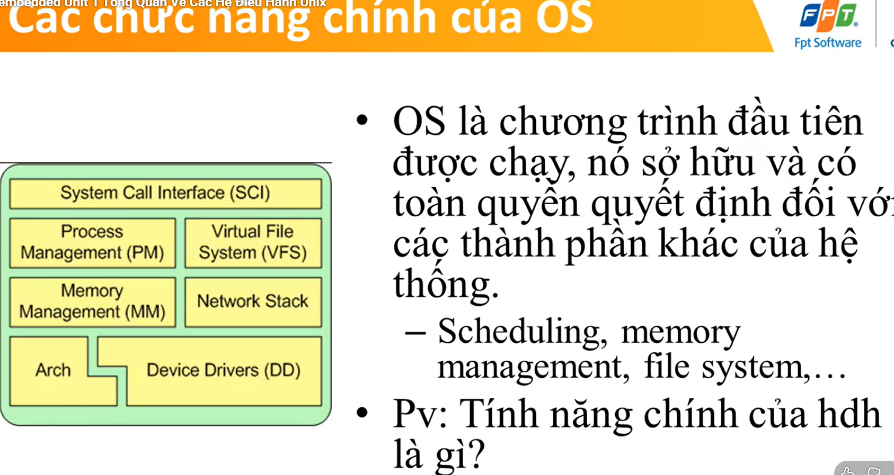
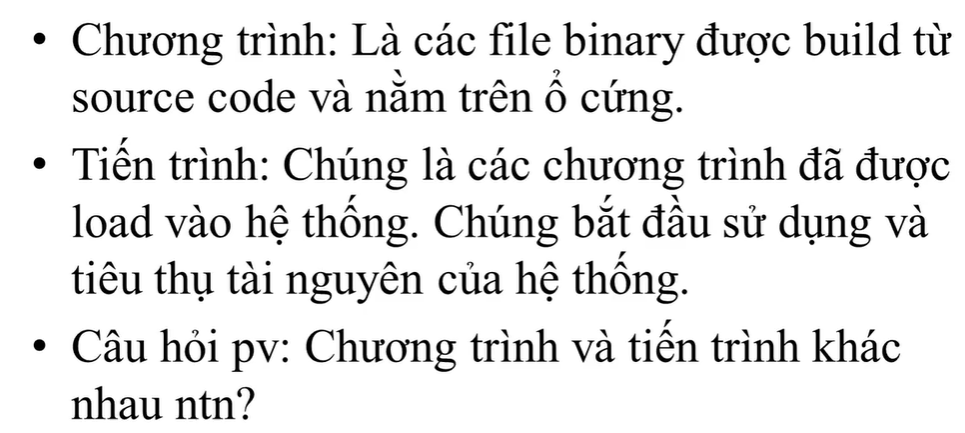

#### 2. Đọc ghi file:

- Phân loại tệp: 

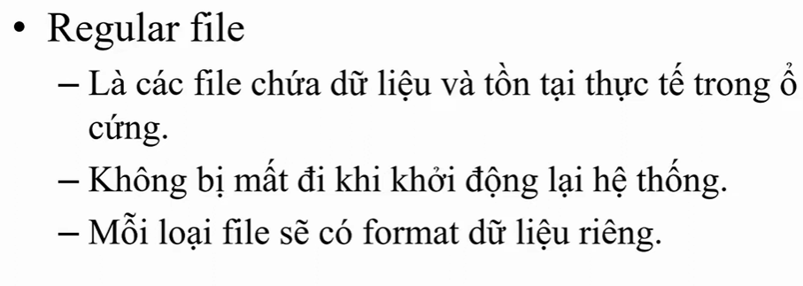
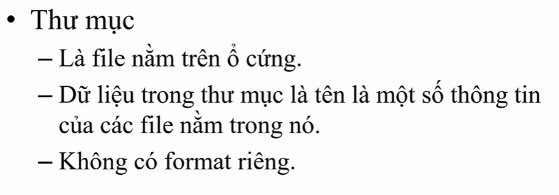
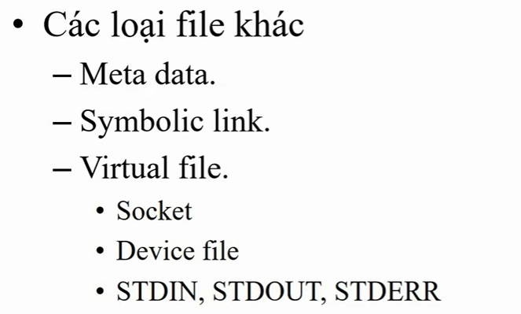

- Các hàm tương tác với file:

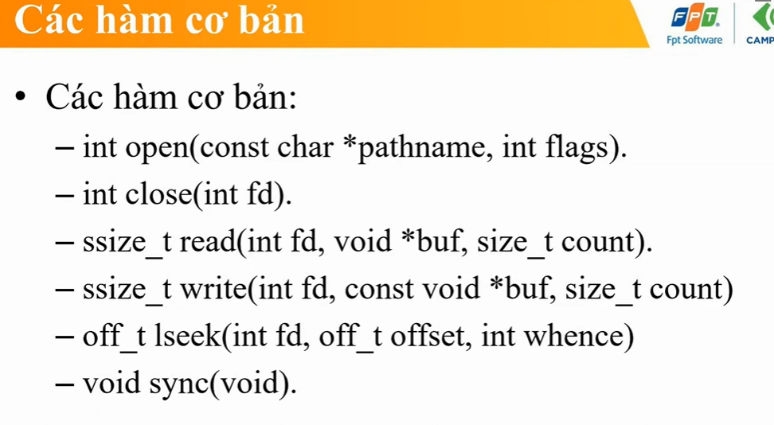

#### 3. Process:

- chúng ta thường hiểu khi bắt đầu chương trình thì sẽ chạy hàm main, nhưng phải thế, cũng giống như vi điều khi, trước khi vào main nó sẽ thưc hiện vài đoạn lênh nhỏ trước đó.
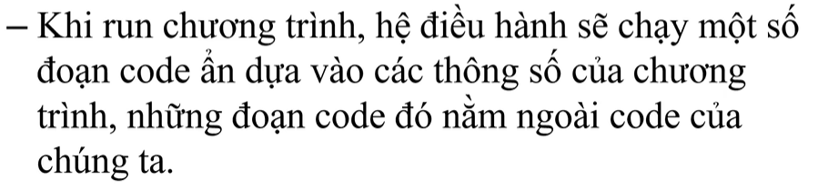
để tạo phân vung nhớ cho chương trình, stdint, stdout,...

- Biến môi trường:

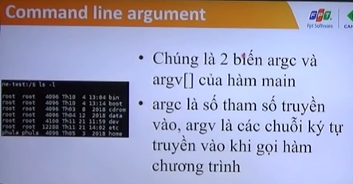 

trong OS, hàm main khi được viết ở trong ngoặc đơn nó không có gì nhưng thực chất khi được biên dịch nó có 2 tham số truyền vào như bên dưới 

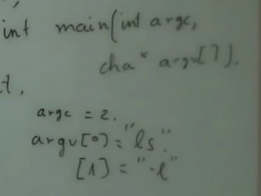 

và đây là nhừng gì được truyền vào khi chương trình khi thực thi lệnh trong terminal trên.

trong OS, thì có thể xem terminal là chương trình cha chạy lệnh `ls` thực chất là chạy 1 chương trình con.

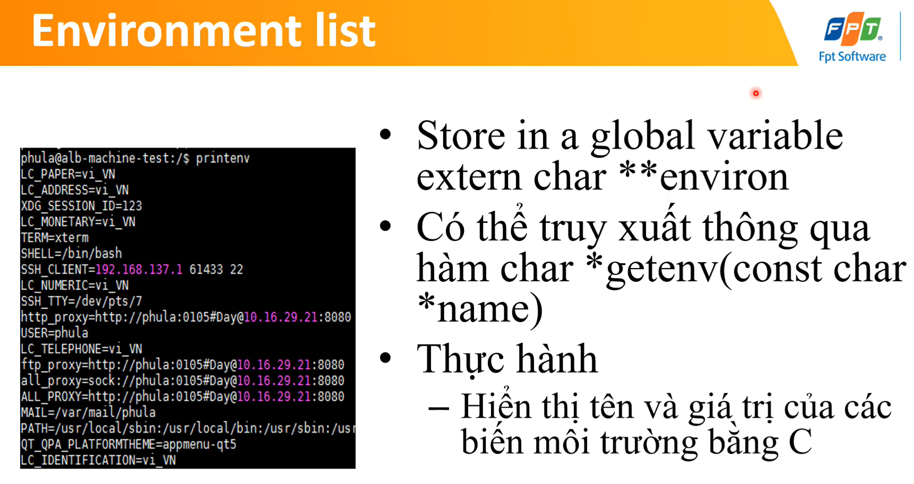

Đây là chương trình in ra thông tin biến môi trường global
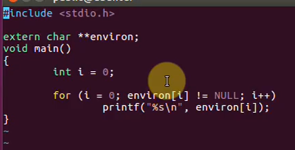

**Terminal login:**

 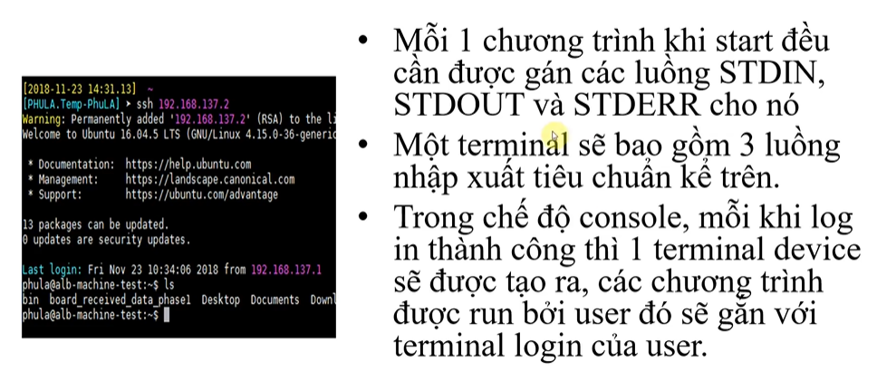
 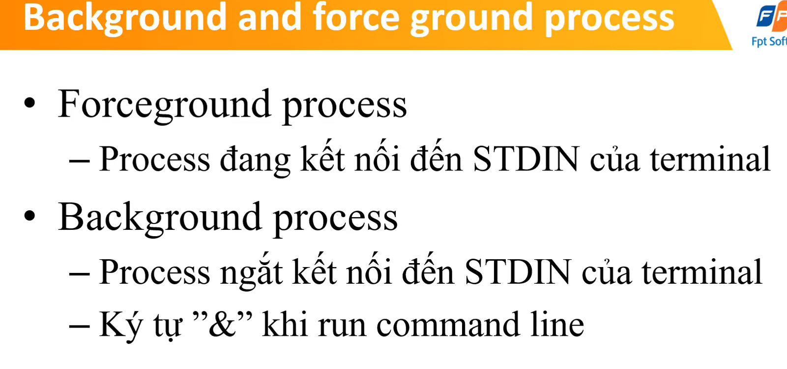
 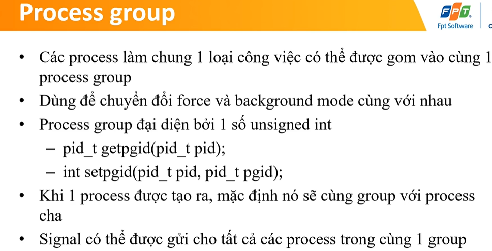
 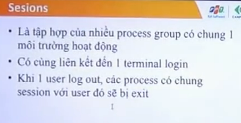

#### 4. Memory layout:

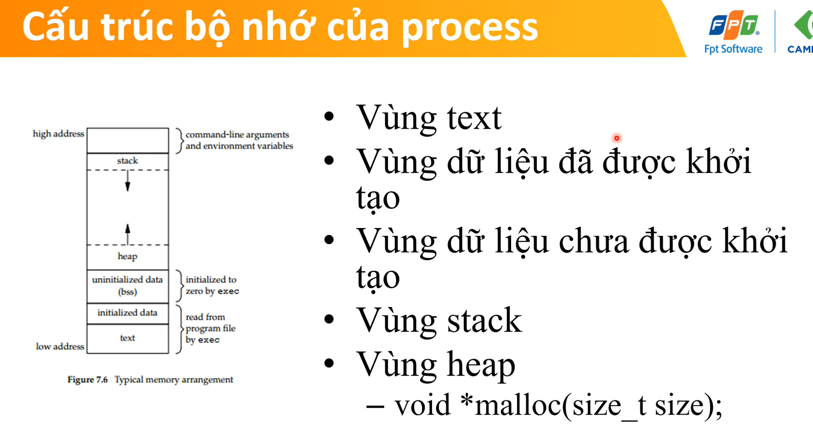

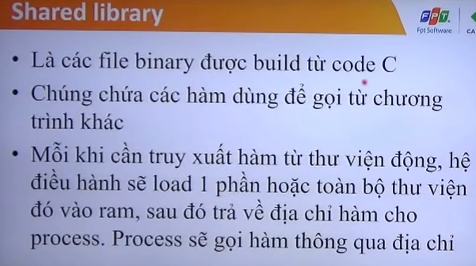 và đây là `dynamic lib`.

ví dụ ở đây là chương trình a.c và chương trình b.c gọi chương trình hello.c

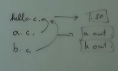

- Khái niệm static lib và dynamic lib:

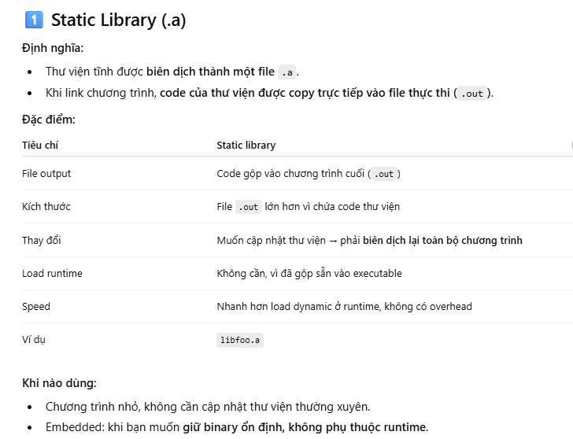
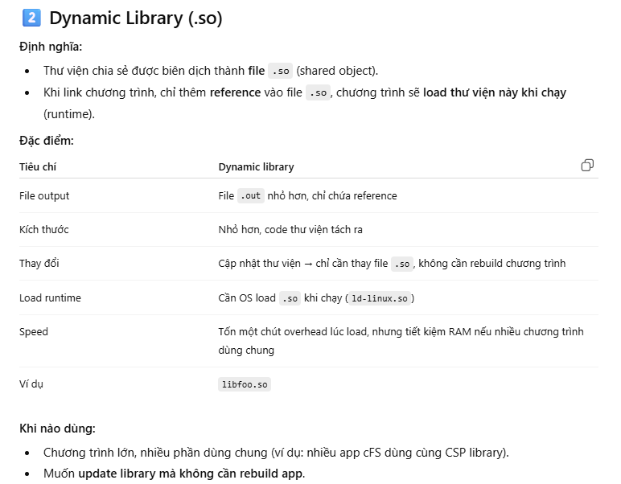
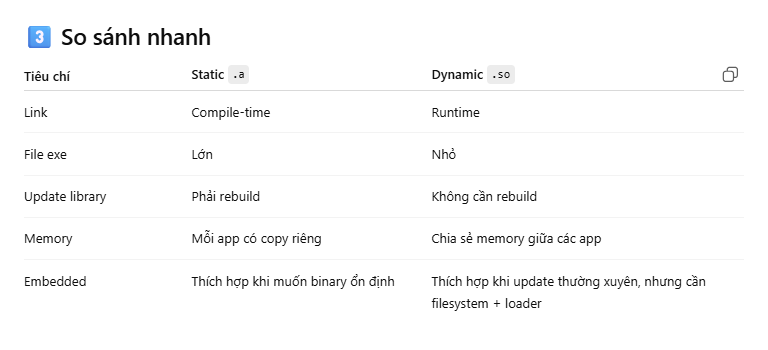

#### 5. Quản lí process:

Sự khác nhau và khi nào cần giữa multithread và nhiều project? 

Process Identifier (PID) trong Embedded Linux là một số nguyên duy nhất dùng để nhận diện một process trong kernel. Và process ID, kernel dùng để quản lý tiến trình.

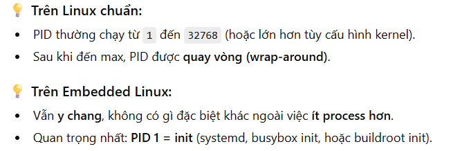

- Có 2 loại process đặc biệt, và PID đặc biệt được dùng đẻ cấp cho 2 process này: swapd process(tiến trình lập lịch) vói PID 0 và init proces. Nó được được sinh ra khi máy được bật lên và kết thúc khi máy tắt.

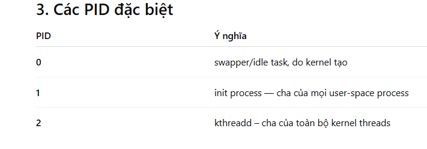

Xem PID của process:

 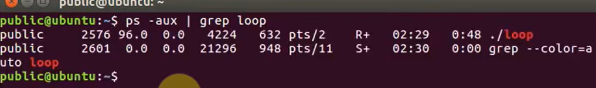

1. Sinh ra process:

- Hàm `fork()`:

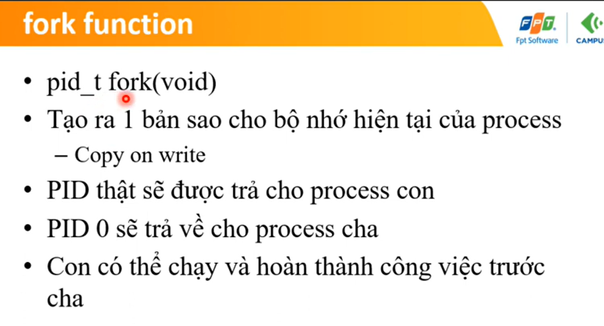

ví dụ:

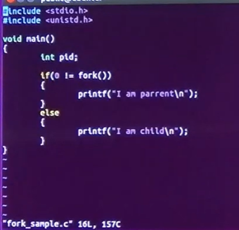
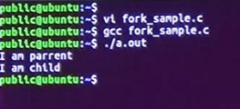

Lí do cho kết quả này là vì chương trình cha dùng fork()
tạo ra chương trình con là chương trình cha từ hàm fork() trở đi(y chang chương trình cha) nhưng 2 chương trình được hàm fork() đều trả về với giá trị khác nhau.

- Hàm `exec`: hàm này khi chạy sẽ ghi đề toàn bộ code phía sau nó kiến không câu lệnh nào sau đó được thực hiện. Hàm này kế thừa PID và các dữ liện trước đó của chương trình cha( là hàm main chẳng hạn)

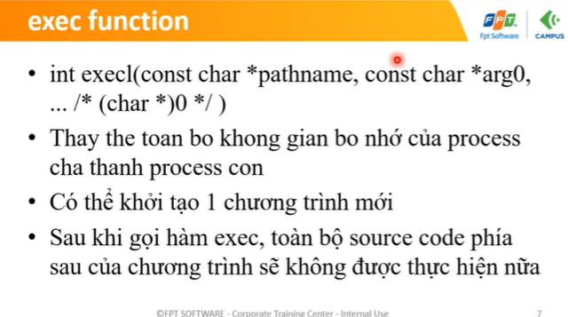

**Ví dụ:** là khi chạy lệnh trên terminal mà nó hiện ra 1 terminal khác để chạy chương trình nào đó thì có nghĩ là terminal chính đang gõ lệnh nó vẫn chạy chướng trình cha bình thường, sau đó nó fork() ra chương trình con và chạy lệnh hàm `exec()` của 1 file nào đó.

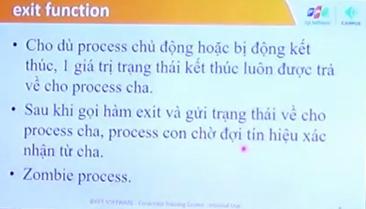

- Zombie là chường trình ở status Z, chưa biến mất haonf toàn nếu chường trình cha chưa thông báo clear, vì vậy vậy chương trình Zombie có thể làm treo hệ thống nếu có nhiều mà mình có thể không nhân ra. Để giải quyết ta dùng hàm `wait()`

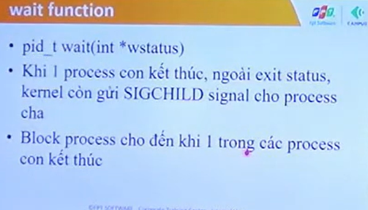

2. User id và group id:

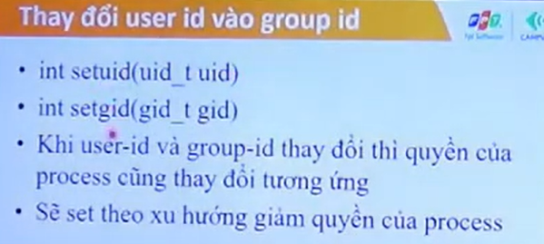

3. Chạy command line trong chương trình C:

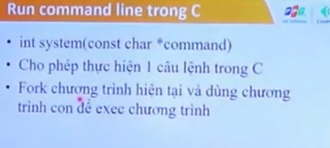

#### 6. Giao tiếp liên tiến trình (IPC - Inter-Process Communication):

Giao tiếp liên tiến trình – các cơ chế để nhiều process (tiến trình) trong Linux có thể trao đổi dữ liệu, đồng bộ, hoặc gửi thông điệp cho nhau.

Mỗi process có vùng nhớ riêng → không thể đọc/ghi trực tiếp bộ nhớ của nhau.

IPC cho phép:
- Trao đổi dữ liệu
- Đồng bộ (synchronization)
- Gửi thông báo sự kiện (event)

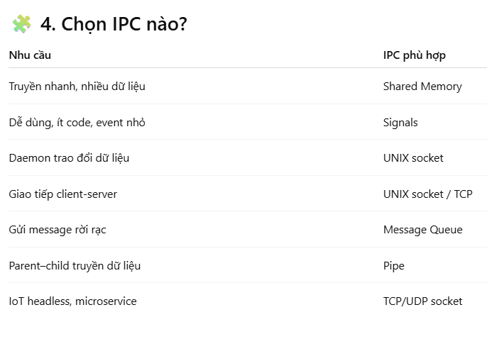

#### 7. Shell script:

- `ls` là một file ELF được viết bằng C có sẵn trong hệ thống. Khi gõ `ls` trong terminal, shell sẽ gọi kernel để thực thi chương trình ELF đó. Shell script (.sh) là tập hợp các lệnh shell, bao gồm cả các chương trình ELF như `ls` và các lệnh built-in, dùng để điều phối và tự động hóa các chương trình (thường là chương trình C).

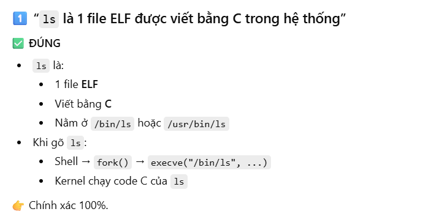

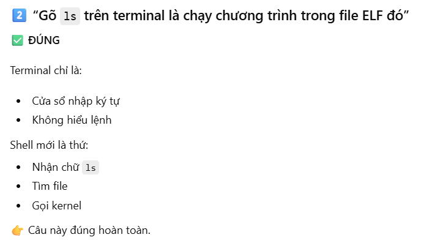

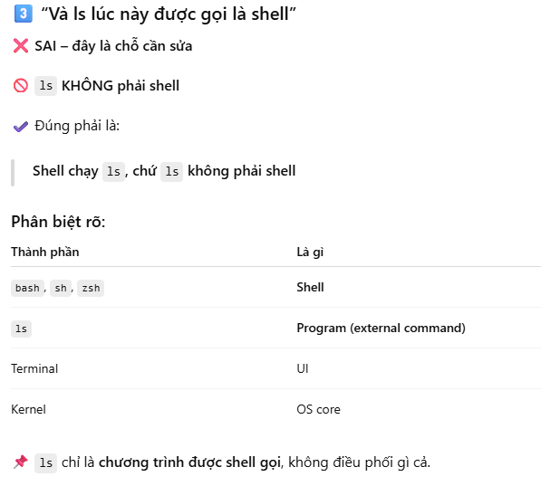

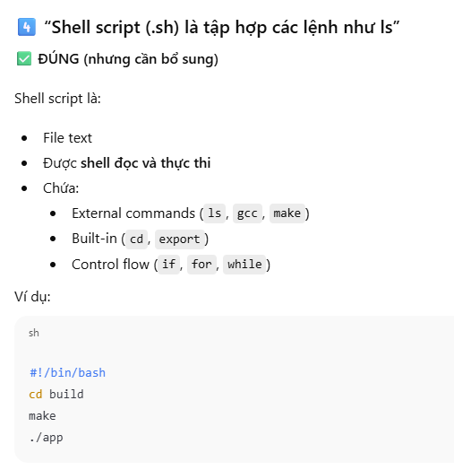

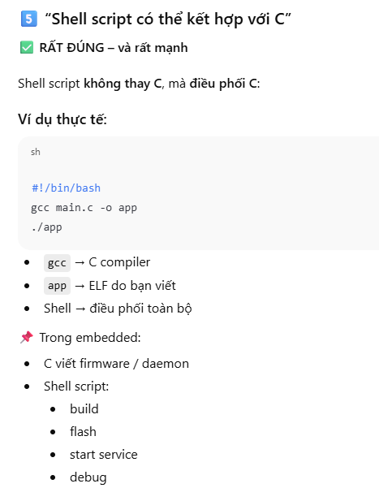

- Shell script dùng để làm gì? Nó (là chương trình thông dịch) dùng để tự động hóa 1 số công việc. Ví du: khi mình liện tục thực hiện công việc phải gõ 10 dòng cmd lại thì mình có thể viết 1 shell script đó nó thực hiện công việc này giúp mình. Nó thường bắt đầu chường trình dòng `#!/bin/bash`, nó sẽ dùng file `bash` chuyên dùng để dich file shell script.

#### 8. Signal:

- Signal là phương pháp để giao tiếp giữa user và process, giữa các process.

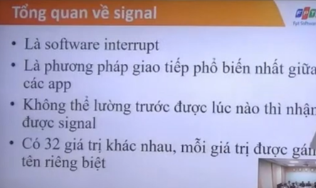

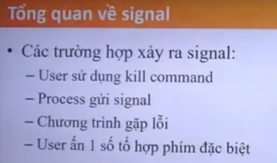

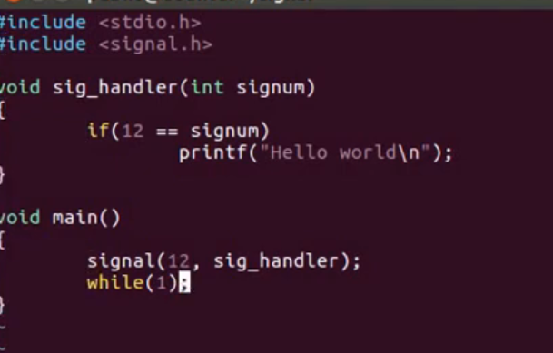
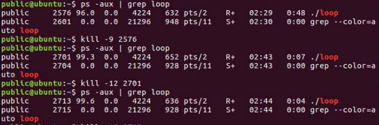
xem trạng thái và pid của process

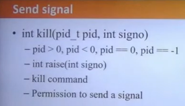

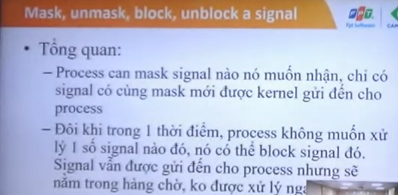

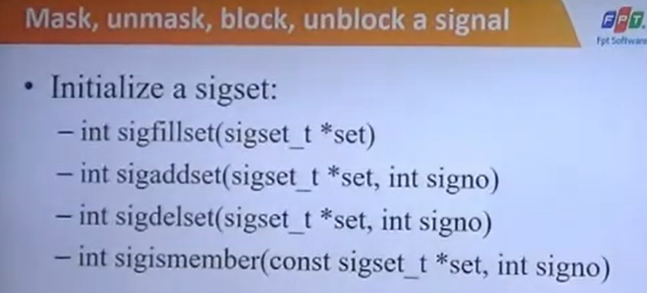

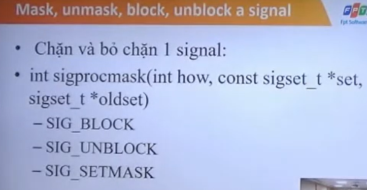

#### 9. Multithread:

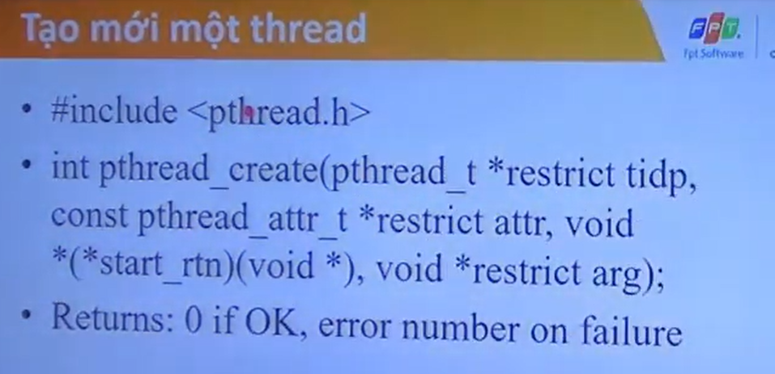

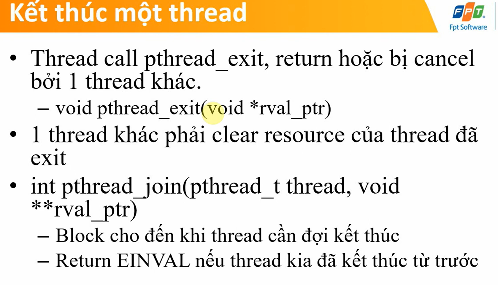

- Tất cả thread đều chung 1 process, vì vậy khi exit() khỏi process thì sẽ tắt hết thread. Vì vậy, vơi những chương trình nguy hiểm, dễ tro thì nên dùng fork() để tạo ra process khác để khi treo thì nó chết cái process đó thôi. Còn nếu dùng thread thì nó chết hết lun.

- Nếu với biến toàn cục, nếu dùng fork() thì biến toàn cục hoặc các biến chung sẽ được copy ra và dùng cho process khác, không chơi theo kiểu các thread đều chia sẻ 1 biến như kiểu thread.

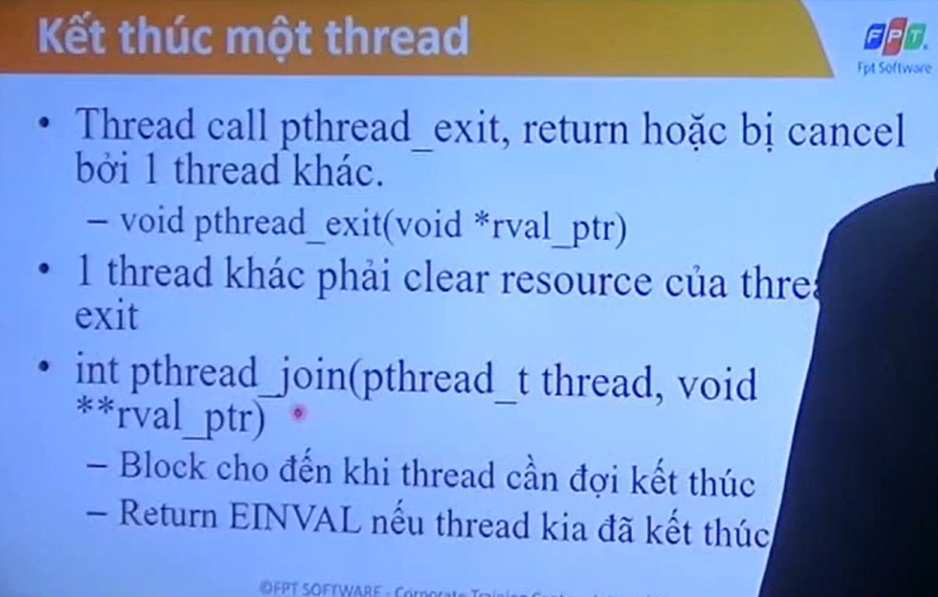