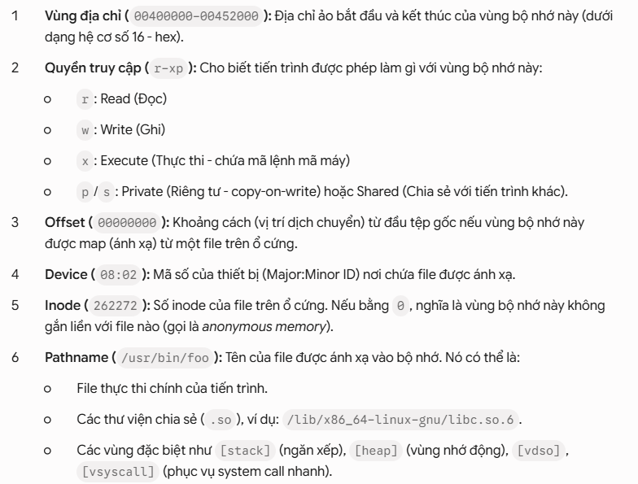

## 1. Kiến thức bị thiếu: MCU vs Linux OS

### 1.1. Memory layout:

Trước khi đọc log, bạn cần nắm được sự khác biệt sống còn về quản lý bộ nhớ giữa 2 thế giới:

Ở MCU (Flat Memory / Physical Address): Khi bạn cấu hình Linker Script (.ld), bạn chỉ định chính xác địa chỉ vật lý của Flash (ví dụ 0x08000000) và SRAM (ví dụ 0x20000000). Con trỏ trỏ đến đâu là truy cập trực tiếp vào cell nhớ vật lý đó. MCU thường không có khái niệm che giấu hay bảo vệ bộ nhớ giữa các hàm với nhau (trừ khi dùng MPU nhưng khá hạn chế).

Ở Linux OS (Virtual Memory + MMU):

Mọi tiến trình (Process) khi chạy đều bị OS "lừa" rằng nó đang sở hữu toàn bộ không gian bộ nhớ khổng lồ độc quyền (ví dụ kiến trúc 64-bit). Địa chỉ bạn thấy trong đoạn code C (addr) hoàn toàn là Địa chỉ ảo (Virtual Address).

Phần cứng có một bộ chuyển đổi tên là MMU (Memory Management Unit) kết hợp với Kernel để dịch cái địa chỉ ảo đó thành địa chỉ thanh RAM vật lý thật.

Do đó, hai tiến trình khác nhau hoàn toàn có thể có chung một con trỏ 0x400000, nhưng MMU sẽ dịch chúng ra 2 vùng RAM vật lý hoàn toàn khác nhau. Điều này giúp các tiến trình không bao giờ ghi đè được vào bộ nhớ của nhau.

Trong hệ điều hành Linux, `/proc/1255/maps` là một file ảo hiển thị bản đồ bố trí bộ nhớ (memory layout) của tiến trình (process) có PID (Process ID) là 1255. 

Du lieệ ben trong file maps `00400000-00452000 r-xp 00000000 08:02 262272 /usr/bin/foo`.

### 1.2. Các thư viện liên kết động (Dynamic Libraries):

Kiến thức bổ sung cho người làm MCU: Ở MCU, khi bạn gọi printf hay malloc, các hàm này nằm trong thư viện chuẩn (libc.a hoặc libm.a) và được Linker biên dịch đóng gói chết cứng vào trong file .bin/.hex để nạp xuống Flash (gọi là Static Linking).

Ở Linux: Vì có hàng trăm chương trình cùng chạy và chương trình nào cũng dùng printf, nếu chương trình nào cũng ôm theo code của hàm printf thì sẽ cực kỳ lãng phí RAM và ổ cứng. Do đó, Linux dùng Dynamic Linking (Liên kết động). File libc-2.19.so (chứa code của printf, malloc) và libpthread-2.19.so (quản lý luồng) được nạp riêng vào RAM thành các vùng nhớ dùng chung. Khi ứng dụng của bạn gọi printf, MMU sẽ trỏ địa chỉ ảo tới vùng nhớ dùng chung này để tiết kiệm tài nguyên.

### 1.3. Vấn đề "Liên tục" trong bộ nhớ ảo và bộ nhớ vật lý:
"Không có gì đảm bảo 100% rằng bộ nhớ ảo liên tục thì bộ nhớ vật lý cũng liên tục... Ở tầng phần cứng, có một thiết bị đặc biệt chịu trách nhiệm dịch từ địa chỉ ảo sang địa chỉ vật lý."

Góc nhìn MCU: Trong MCU (như STM32, SAMV71), bộ nhớ là một dải phẳng thẳng tắp. Khi bạn khai báo một mảng uint8_t buffer[1024];, bạn chắc chắn 100% rằng 1024 bytes này nằm liên tục nhau trên các ô nhớ vật lý của SRAM.

Góc nhìn Linux OS: * Khi bạn xin cấp phát một vùng nhớ ảo liên tục dài 4MB (tương đương 1000 trang bộ nhớ - Pages), đối với tiến trình của bạn, nó là một dải địa chỉ liên tục từ 0x400000 đến 0x800000. Bạn có thể tăng con trỏ p++ để duyệt mảng một cách bình thường.

Tuy nhiên, dưới RAM vật lý (thanh RAM cắm trên bo mạch), Kernel có thể bốc 1000 Pages này từ những vị trí nằm rải rác, phân mảnh lung tung ở khắp nơi để đưa cho bạn.

Thiết bị đặc biệt mà tác giả nhắc đến chính là **MMU** **(Memory Management Unit)**. Mỗi khi CPU thực hiện một lệnh đọc/ghi bộ nhớ, MMU sẽ tra cứu một bảng dịch địa chỉ gọi là Page Table để đổi địa chỉ ảo thành địa chỉ vật lý thật trên RAM một cách cực nhanh. Quá trình này hoàn toàn trong suốt với lập trình viên C, bạn không hề biết (và không cần biết) RAM vật lý của mình đang bị phân mảnh.

### 1.4. Major và Minor Device Number trong Linux:

Trong MCU, khi bạn viết Driver cho ngoại vi, bạn quản lý trực tiếp bằng địa chỉ thanh ghi (ví dụ: Driver cho UART1, UART2, SPI1).

Linux OS kiến thức hệ thống: Linux quản lý phần cứng theo triết lý "Everything is a file" (Mọi thứ đều là file). Tất cả các driver thiết bị (ổ cứng, chuột, bàn phím, cổng serial) đều được đại diện bằng một file đặc biệt nằm trong thư mục /dev/.

Major Number: Định danh loại Driver (thiết bị điều khiển nào chịu trách nhiệm cho file này).

Minor Number: Định danh thiết bị cụ thể do Driver đó quản lý.
