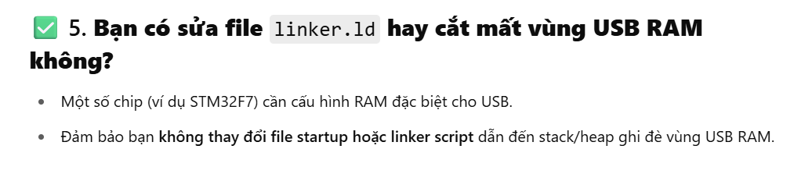
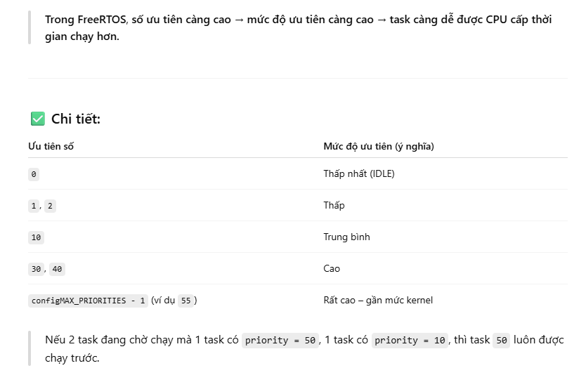
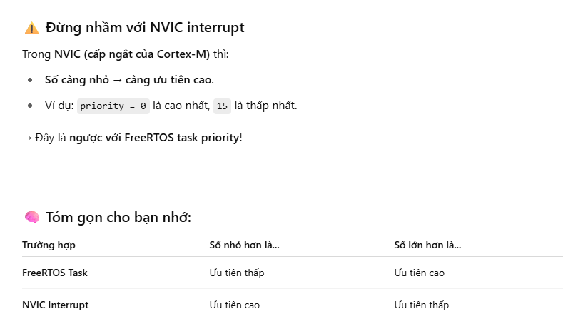
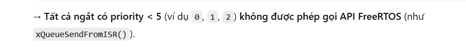
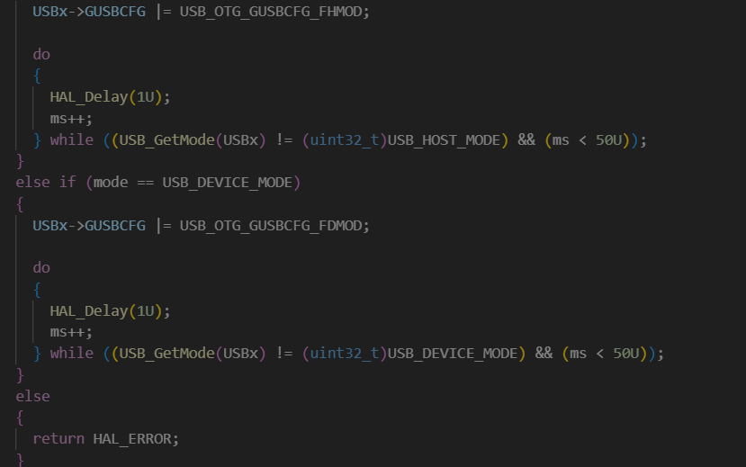
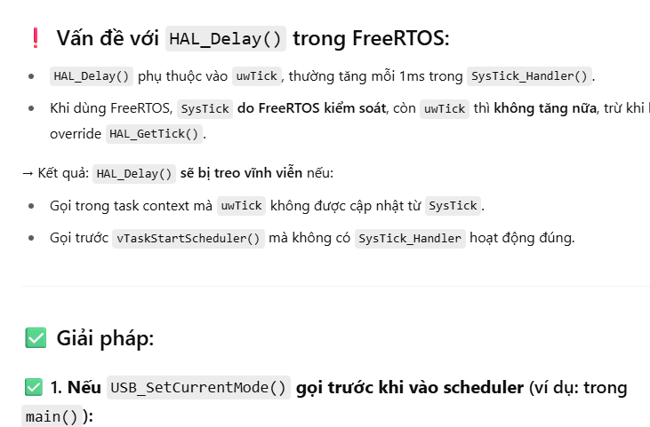

### 1. Thực hiện chỉnh sửa stack STM32F7 từ CDC thành ECM

1. Lưu ý đầu tiên: 
Vì vậy, cách làm của tôi lúc này là generate code, sau đó tách thành thư mục riêng, xóa thư mục tự generate trước đó( tuyệt đối không generate lại lần nữa vì sẽ phải chỉnh linker, hoặc 1 số thày đổi nào khác nếu có không lường trước đc). Cách này để mỗi lần muốn thêm ngoại vi nào đó khác vào, chỉ cần IOC generate ra và xóa thư mục USB tự gen lại mà không bị mất code đã chỉnh sửa của folder USB đã chỉnh.

2. 

3. Tích hợp TCP vào USB ECM, thì tác giả làm có thay đổi HAL_Delay trong hàm `USB_SetCurrentMode` của stm32f4xx_ll_usb.c

Vì vầy chỗ này không cần thay đổi HAL_delay đâu, chỉ cần đựa hàm `MX_USB_DEVICE_Init` lên trước khi chạy FreeRTOS hay tạo bất kì task nào là được.