### I. Lý thuyết:

1. HTTP (HyperText Transfer Protocol):

- Là hình thức truyền tải siêu văn bản. Là quy tác chuẩn dùng để truyền dữ liệu giữa trình duyệt web(client) và máy chủ web (server).

- Chạy trên nền TCP/IP. Được dùng trong hầu hết các ứng dụng web và API hiện nay.

- Khi ta truy cập `https://example.com`, trình duyệt sẽ gửi đi lệnh 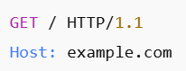 

    và máy chủ sẽ phản hồi 

    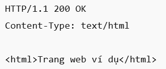

- HTTPS khác HTTP là có thêm mã hóa và bảo mật dữ liệu, dùng cổng 443 thay vì cổng 80.

2. Giải thích chức năng của USB ECM: Lúc này USB device hoạt động như một card mạng ảo, và chúng ta có thể dùng host(laptop) mở trình duyệt (như 1 client trong http) và truy cập vào USB device(trong USB device sẽ chạy chương trình hoạt động như 1 server nói trên và có thể phản hồi nhữ gói tin mạng) bằng địa chỉ IP như vào 1 trang web thật.
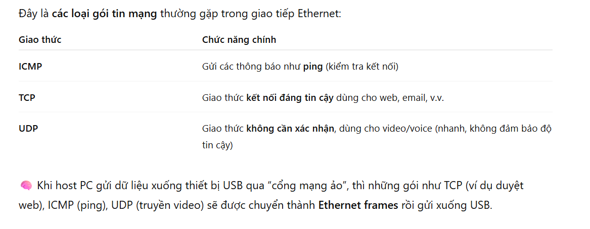

- Ethernet frames: hà đơn vị dữ liệu thấp nhất của mạng Ethernet, chứa header (địa chỉ MAC, loại gói…) và payload (dữ liệu chính, ví dụ như TCP/IP hoặc ICMP).

Khi dùng giao thức ECM, mỗi frame Ethernet được đóng gói vào USB bulk transfer, gửi qua endpoint.

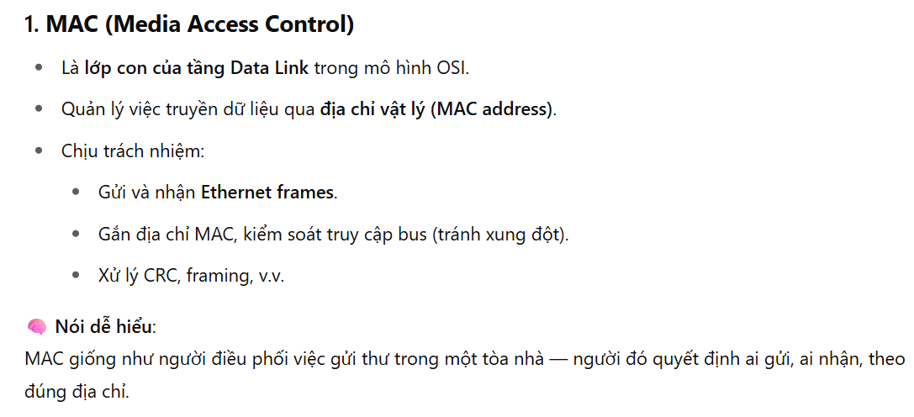

Mô hình OSI:

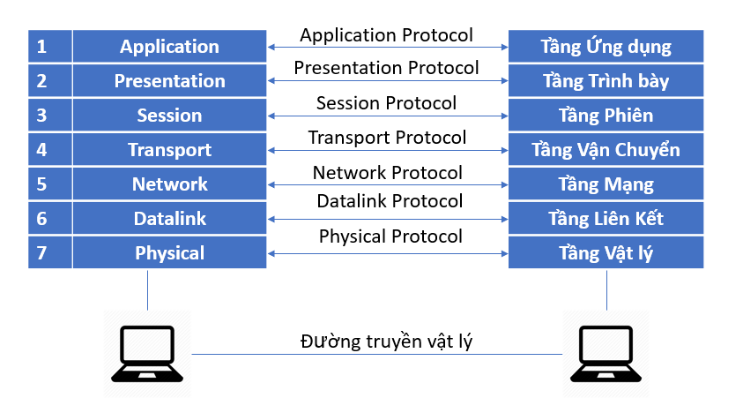

3. USB CDC là chuẩn có hỗ trợ nhiều Subclass cho các thiết bị mạng khác nhau. Các loại mạng qua Ethernet qua USB được sử dụng:
Ethernet Control Model (ECM), Ethernet Emulation Model (EEM),Network Control Model (NCM).

#### 1. USB ECM:

 USB ECM dùng Bulk transaction
 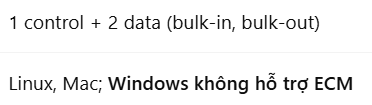

- Các Define và Descriptor:

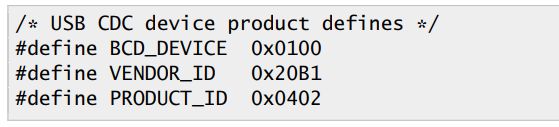
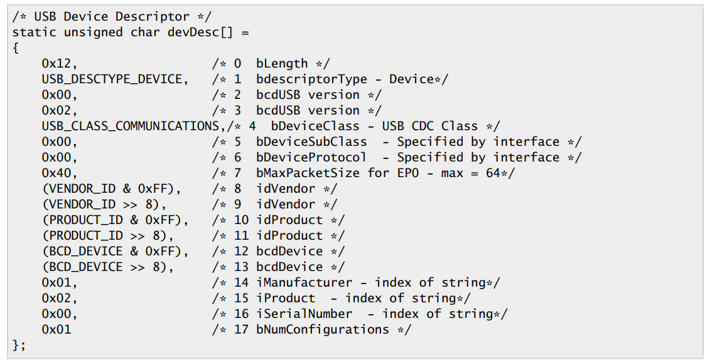

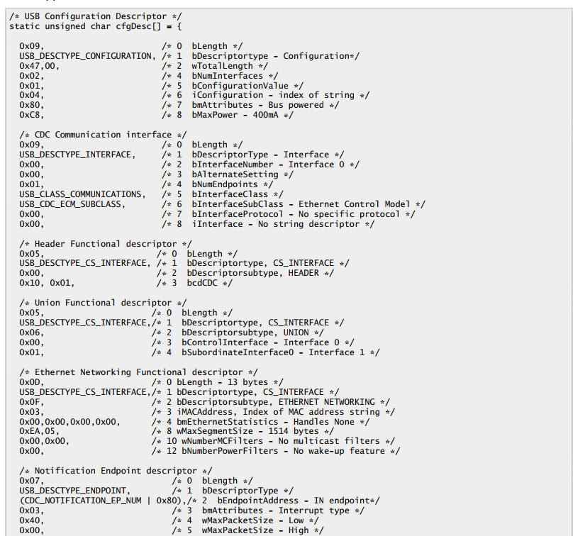
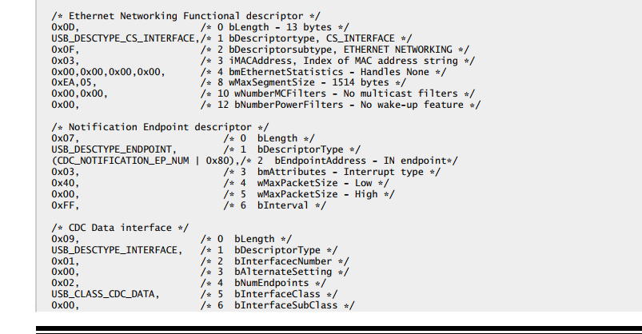
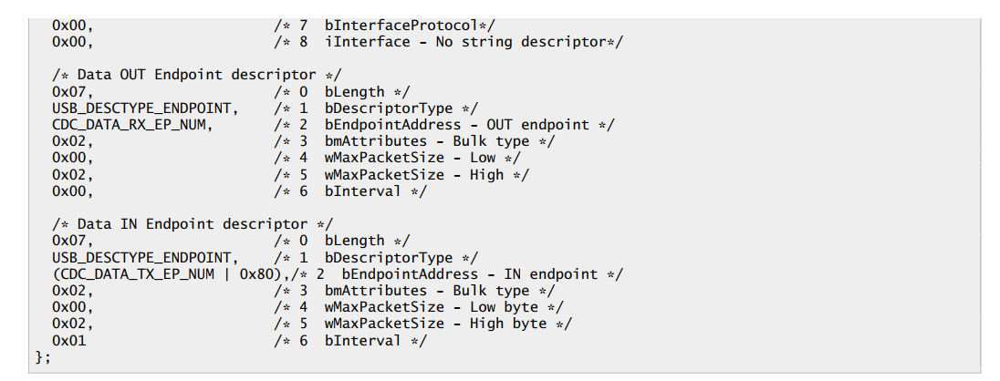
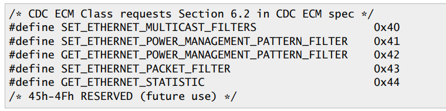

- USB ECM có 2 interface desriptors: CDC Communication interface và CDC Data interface

- Mỗi Ethernet frame: 
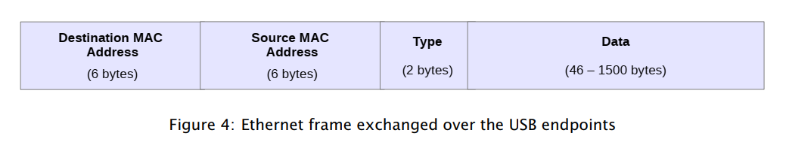

- LwIP (Lightweight IP) là một stack giao thức TCP/IP mã nguồn mở được thiết kế để sử dụng trong các hệ thống nhúng có tài nguyên hạn chế như vi điều khiển (MCU).

- TCP/IP là ngôn ngữ chung của Internet — mọi thiết bị (PC, điện thoại, router, camera, thiết bị nhúng...) khi kết nối mạng đều phải dùng TCP/IP để gửi và nhận dữ liệu.

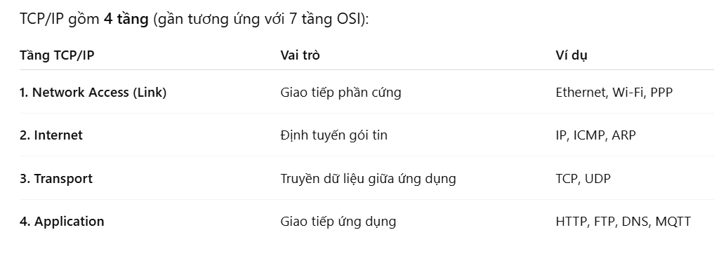

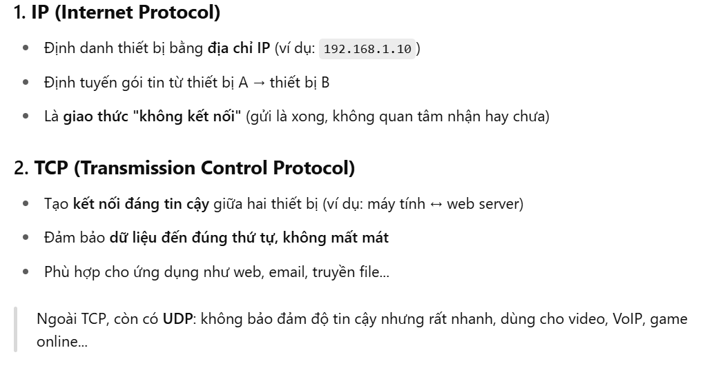

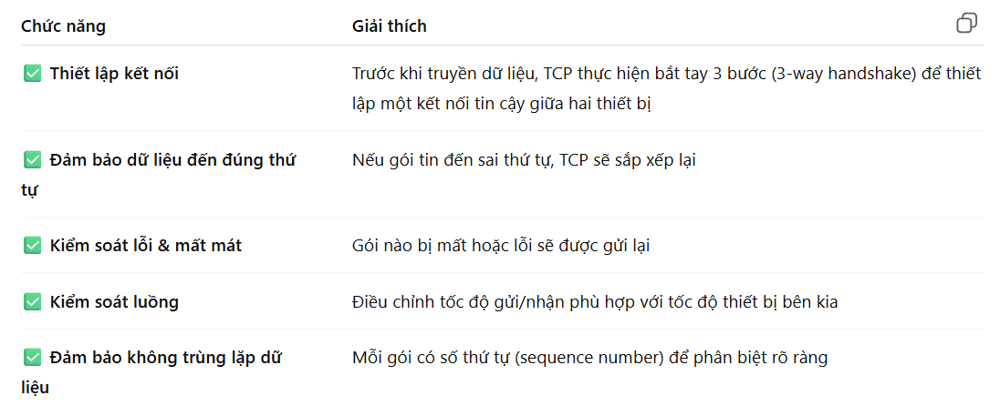

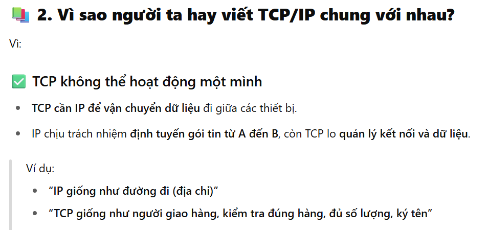

#### 2. Chạy thử USB ECM với TinyUSB trên STM32F7

Hướng dẫn các add USBTiny vào project

Những thư mục cần pull về:
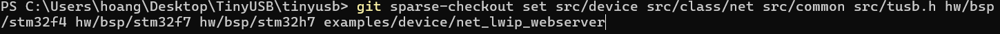

Nếu thêm đường dẫn vào rồi mà nó vẫn báo lỗi vào những trường hợp như này 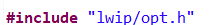 thì lúc này cần chuột phải vào thư mục nhấn vào chỗ xám như trên hình
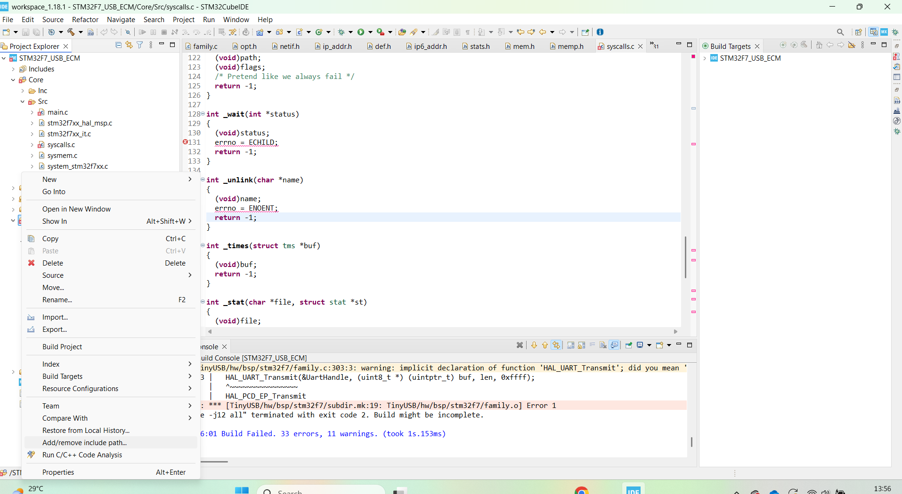

- Bước 1 vào file tusb_config.h: để cấu hình cho TinyUSB

```C
#ifndef _TUSB_CONFIG_H_
#define _TUSB_CONFIG_H_

#define CFG_TUSB_MCU OPT_MCU_STM32F7
#define CFG_TUSB_RHPORT0_MODE OPT_MODE_DEVICE
#define CFG_TUD_ENABLED 1
#define CFG_TUD_NET 1
#define CFG_TUD_NET_ECM_RNDIS 1
#define CFG_TUD_NET_MTU 1514

#endif
```

Trong file main.c
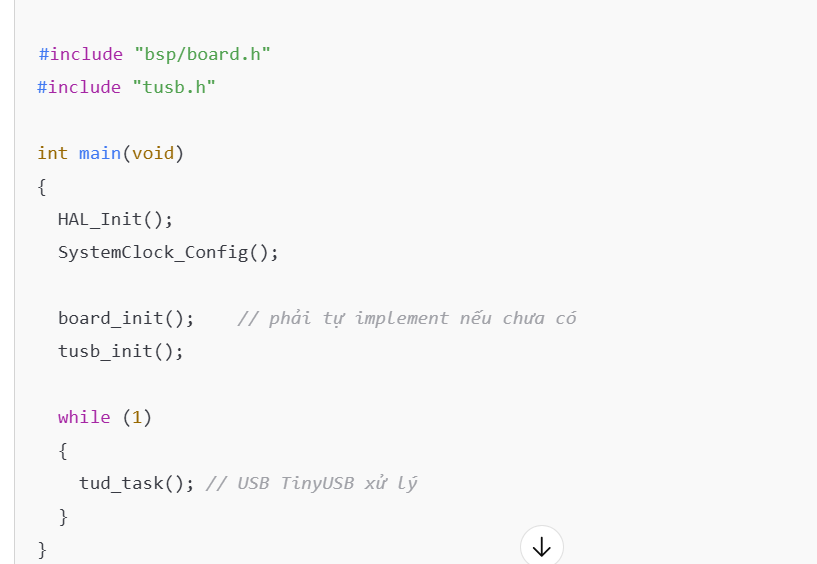

Chưa thêm vào file những hàm này:
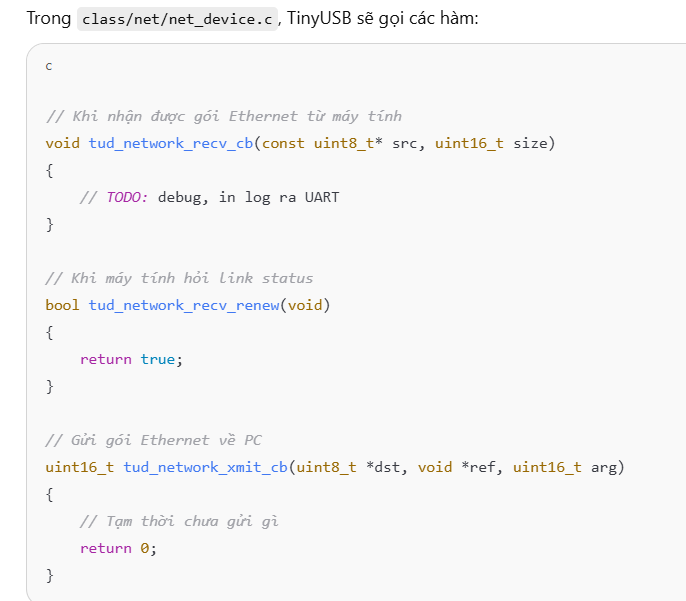

- Bước 2: