### Cấu hình IOC:
- Đây là cấu hình USB CDC, không được phép bật RCC (lỗi nhận diện USB).

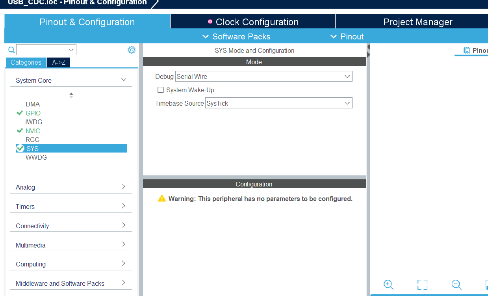

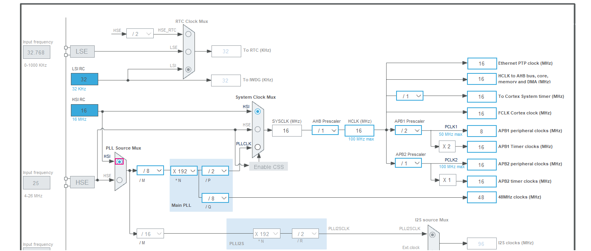

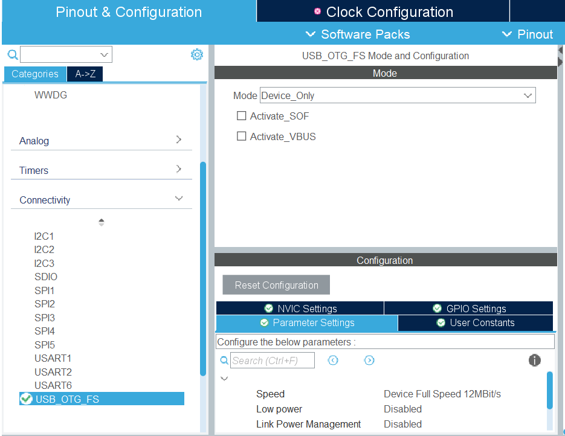

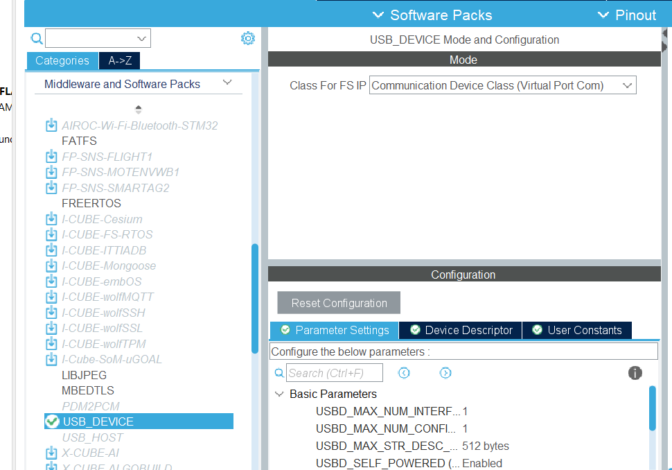

### Code trong Cube:

https://sudonull.com/post/68144-CDC-MSC-USB-Composite-Device-on-STM32-HAL.(cực kì có ích)
- File usbd_def.h: dùng để chứa các macro define cho USB class, interface, string,...
- Các file: usbd_desc.c (device descriptor) and usbd_cdc.c (configuration descriptors, interfaces, endpoints). Ta cần tập trung chú ý vào những thông số (đặt biệt là có chú thích) sau:

- File usbd_conf.c chứa các hàm callback, config, và LL_init liên quan đến USB.c

##### 1. USB CDC:

1. Device descriptor: (usbd_desc.c)

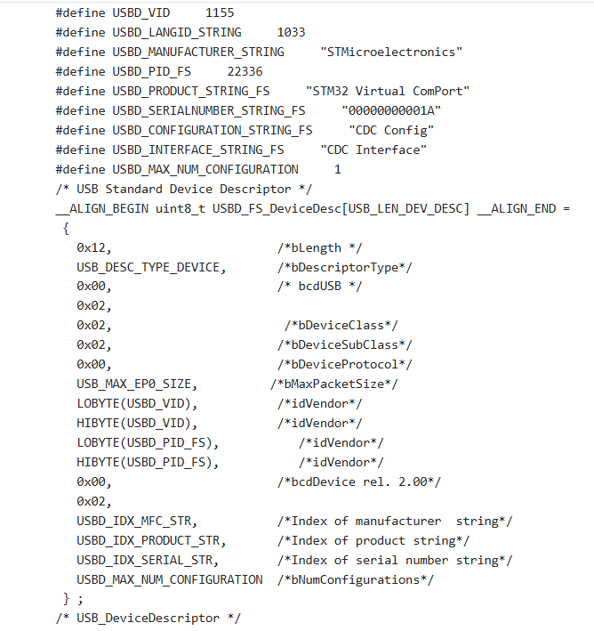

- bDeviceClass, bDeviceSubClass và bDeviceProtocol - mô tả cho host thiết bị chúng ta có, những gì nó có thể làm và trình điều khiển nào để tải. Trong trường hợp này, nó nói rằng thiết bị của chúng ta triển khai Communication Device Class, có nghĩa là máy chủ cần tạo một cổng COM ảo và kết nối nó với thiết bị này.

- PID (Product ID) và VID (Vendor ID): Host phân biệt giữa các thiết bị khác nhau được kết nối.

2. Configuration descriptor: (usbd_cdc.c)

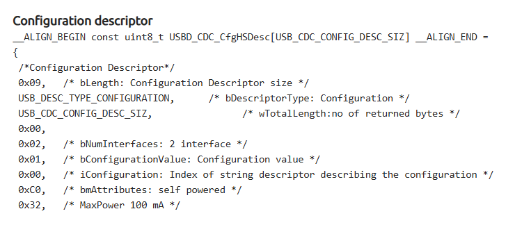

- wTotalLength - kích thước của toàn bộ gói mô tả cho cấu hình này - để máy chủ biết cấu hình này kết thúc ở đâu và cấu hình tiếp theo bắt đầu ở đâu. Chúng ta sẽ cần sửa nó khi tạo một thiết bị tổng hợp. Tôi xin nhắc lại rằng tất cả các giao diện cho cấu hình này phải là một khối rắn và giá trị wTotalLength xác định độ dài của khối này.

- bNumInterfaces: Lớp Thiết bị truyền thông được triển khai bằng hai giao diện. Một giao diện để quản lý, một giao diện khác để gửi dữ liệu thực tế.

- bmAttributes và MaxPower cho biết thiết bị của chúng tôi có nguồn điện riêng, nhưng đồng thời muốn tiêu thụ tới 100 mA từ cổng USB. Những thông số này rõ ràng sẽ phải thay đổi trong tương lai.

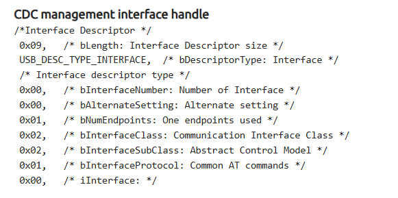

- Chú ý số lượng endpoint (bNumEndpoint).

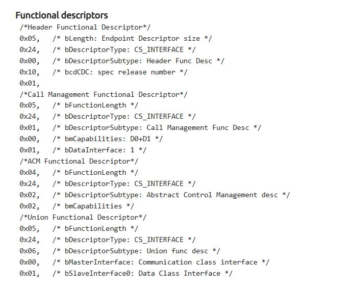

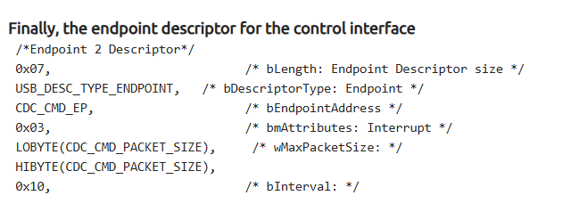

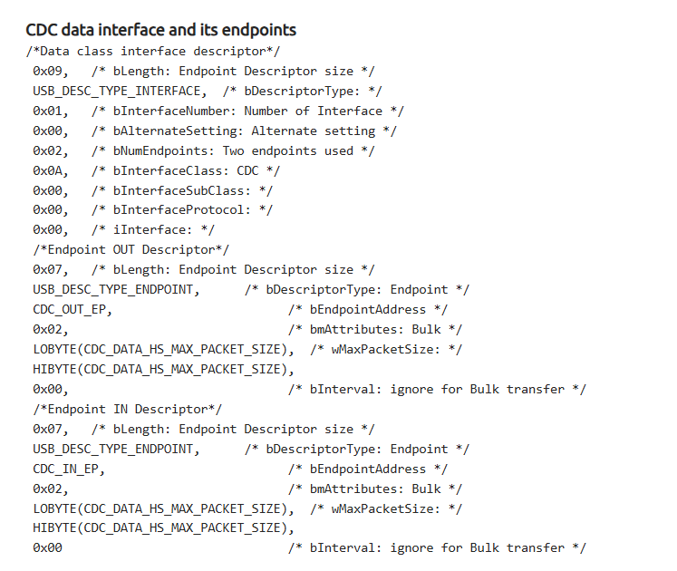

##### 2. USB MSC:

1. Device descriptor: (usbd_desc.c)

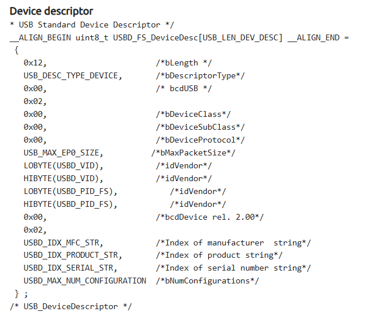

- không có sự khác biệt nhiều, chỉ khác chỗ device class (zeros in bDeviceClass)

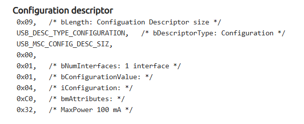

- giống CDC.

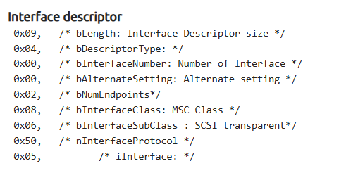

- khai báo 2 endpoints

#### 1. Các tầng USB được viết thư viện ST:

Thư viện USB từ ST có rất nhiều lớp. Tôi muốn làm nổi bật các cấp độ kiến ​​trúc như vậy

- Trình điều khiển lớp (trong trường hợp của CDC, đây là các tệp usbd_cdc và usbd_cdc_if): chúng triển khai logic của một lớp thiết bị cụ thể - CDC cho cổng COM ảo, MSC cho thiết bị lưu trữ, HID cho bàn phím/chuột và bất kỳ thiết bị cụ thể nào có giao diện người dùng.

- USB Core (usbd_core.c, usbd_ctlreq.c, usbd_ioreq.c): triển khai logic chung của hoạt động của tất cả các lớp thiết bị USB, có thể gửi các mô tả được yêu cầu đến máy chủ, xử lý các yêu cầu từ máy chủ và cấu hình toàn bộ thiết bị USB. Nó cũng chuyển hướng các luồng dữ liệu từ cấp trình điều khiển lớp đến các cấp cơ bản và ngược lại.

- USB HW Driver (usbd_conf.c): Các lớp chồng lên nhau không phụ thuộc vào nền tảng và hoạt động theo cùng một cách đối với một số dòng vi điều khiển. Mã không có lệnh gọi hàm cấp thấp cho một vi điều khiển cụ thể. Tệp usbd_conf.c triển khai một lớp giữa USB Core và HAL, một thư viện trình điều khiển cấp thấp cho vi điều khiển đã chọn. Về cơ bản, có các trình bao bọc đơn giản chuyển hướng lệnh gọi từ trên xuống dưới và lệnh gọi lại từ dưới lên trên.

- HAL (stm32f1xx_hal_pcd.c, stm32f1xx_ll_usb.c): tham gia giao tiếp với phần cứng vi điều khiển, hoạt động với các thanh ghi và phản hồi các ngắt.

> **Ở giai đoạn này, chúng ta chỉ quan tâm đến lớp trên cùng và một hàm từ usbd_conf.c.**

#### 2. Thử chạy USB MSC trong Stm32:

#### 3. Những thay đổi thành USB composite (MSC --> CDC+MSC):

- Bước 1: usbd_desc.c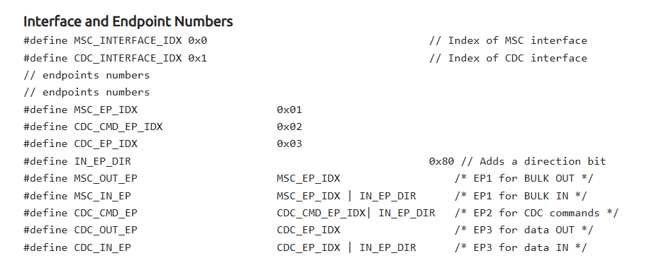 
> Endpoint 0 (EP0) được sử dụng để qunar lí chung cho thiết bị. 
>
> EP1 dùng cho MSC.
> CDC thì cần 1 EP IN cho interrupt (chủ yếu nhiệm vụ ở đây là thông báo cho host biết trạng thái của thiết bị). CDC cũng dùng 2 interface nên cần có IAD để nhóm 2 interfce thành 1 chức nawg để host biết điều này (trách host nhầm lẫn là có 2 chức năng ở đây).
>
> Lúc này CDC phải dùng EP3 cho data (lưu ý EP phải dùng theo cặp OUT 0x01 thì IN 0x81, không được chèn lẫn lộn)

- Bước 2: usbd_desc.c 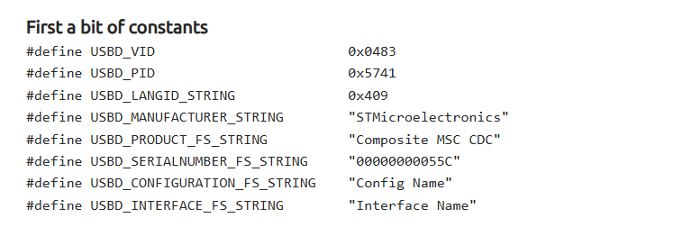

> chỉ nên thay đổi những chuỗi.

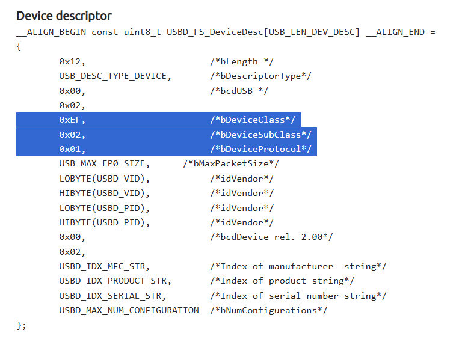

> sửa phần bôi màu xanh.

- Bước 3: usbd_msc/cdc.c sửa configuration 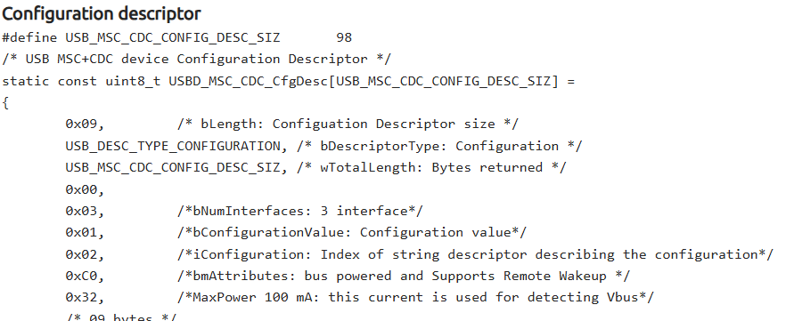

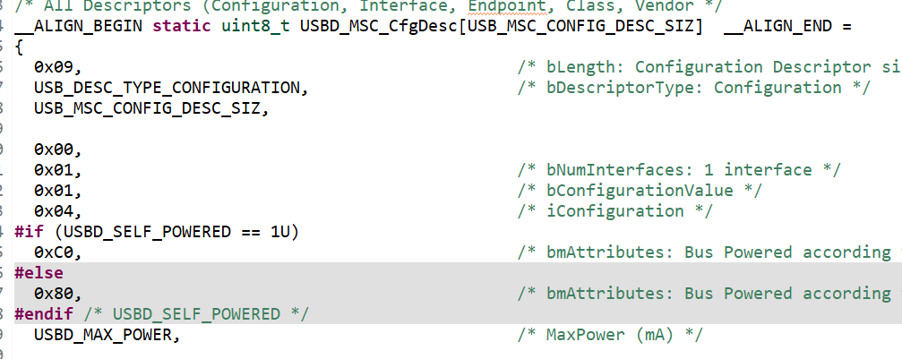

> `USB_MSC_CDC_CONFIG_DESC_SIZ       98` tổng kích thước của cấu hình (tính trong cái mảng này)
> 
>`0x03,         /*bNumInterfaces: 3 interface*/`
>
>`0x01,         /*bConfigurationValue: Configuration value*/`
>
>...

- Bước 4: 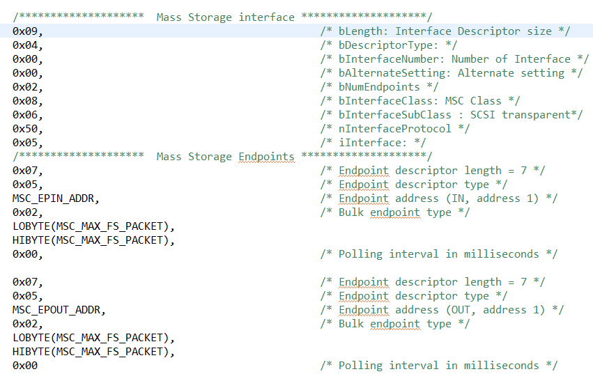
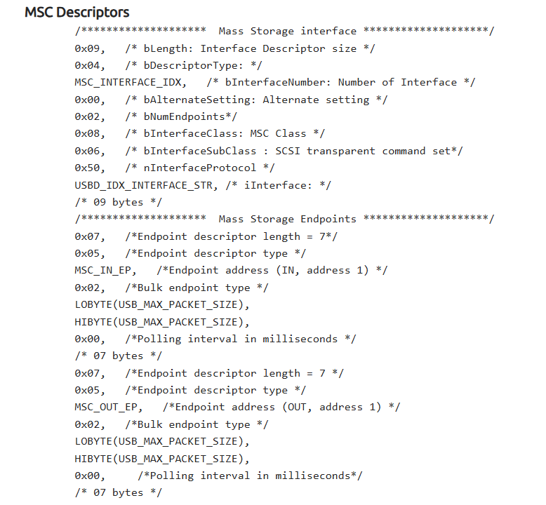

> chủ yếu thay đổi các giá trị và địa chỉ Endpoint.

- Bước 5: thêm tiếp vào để host biết MSC đã kết thức và giờ là CDC với IAD là để nhóm 2 interface 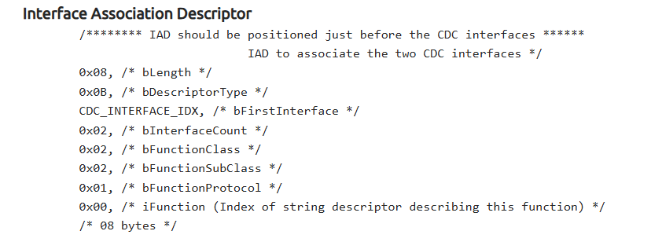

- Bước 6: các mô tả CDC 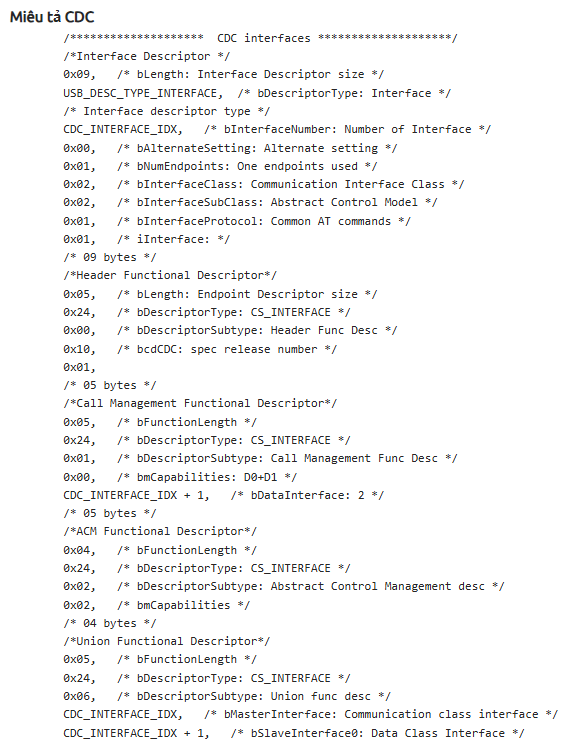 

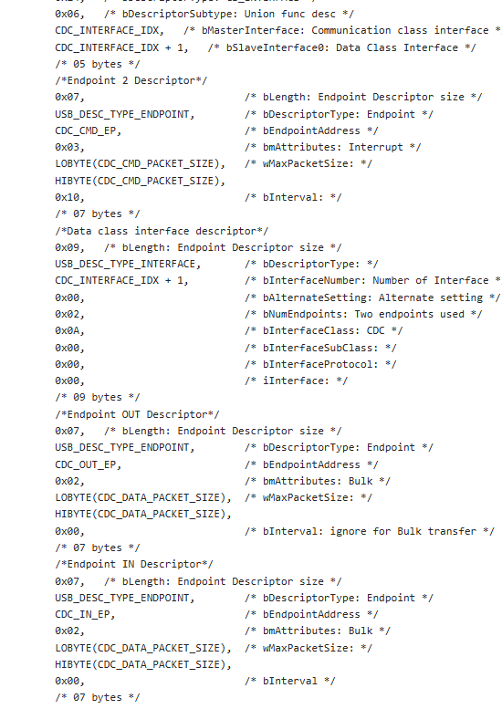

- Bước 7: thay đổi `USBD_ClassTypeDef` bên trong `usbd_def.h`

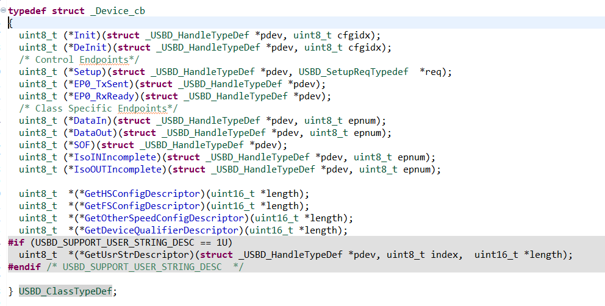

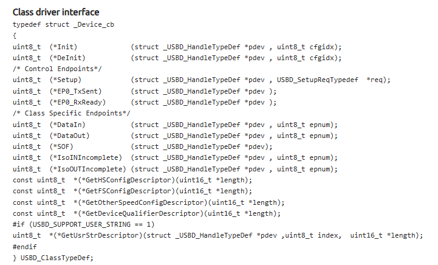

> Hiện tại thì thấy gần như y chang nhau. Đây là các hàm callback (gọi lại) mà một USB class (CDC, HID, MSC, v.v.) cần cài đặt để tương tác với USB Device Core.
>
> Việc này giúp tách biệt phần lõi USB (core) và phần xử lý đặc thù theo từng class.

- Bước 8: trong usbd_msc/cdc.c viết thêm các hàm init_composite, deinit_composite, không được xóa mấy cái cũ, và đưa file code cdc vào(vì hiện tại chỉ mới generate code của MSC nên hoàn toàn không có của class của CDC).

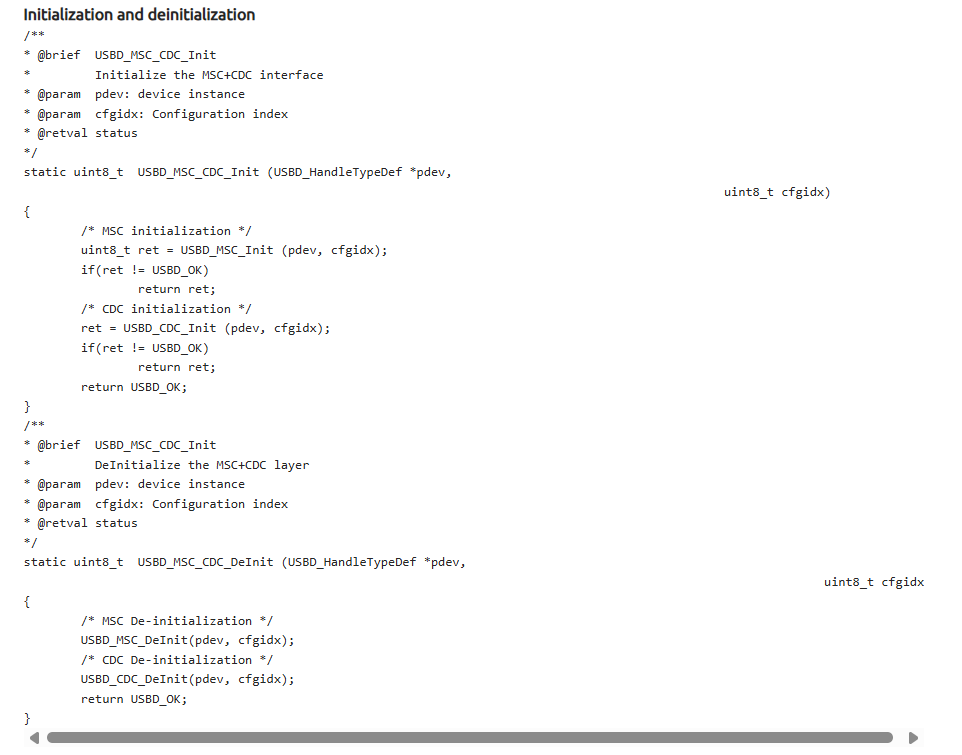

> thêm vào thư mục:

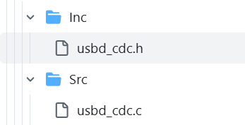

- Bước 9: thêm hàm setup 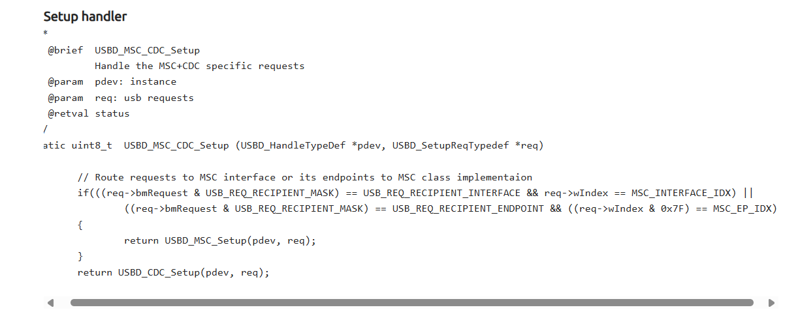

> Phân luồng (route) các USB setup request đến đúng class (MSC hoặc CDC) tùy vào interface hoặc endpoint được yêu cầu.

> hàm trên dùng để phân luồng đi phù hợp( nên chọn MSC, CDC). Ở đây, code dựa vào field bmRequestType và wIndex trong Setup Packet để phân biệt CDC và MSC, sau đó phân luồng. 

> Có nhiều thông số khác để có thể phân biệt nữa nhưng ở đây chỉ cần nhìn bmRequestType và wIndex là đủ để biết yêu cầu đó thuộc interface nào → chuyển đến đúng class handler.

- Bước 10: thay đổi cái define này nữa(usbd_conf.h): 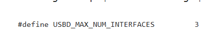

- Bước 11: thêm vào 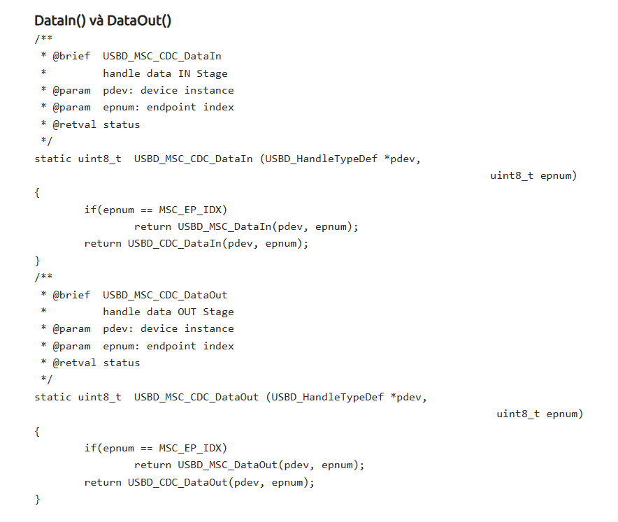

> Xử lý data IN/OUT stage.

- Bước 12: 
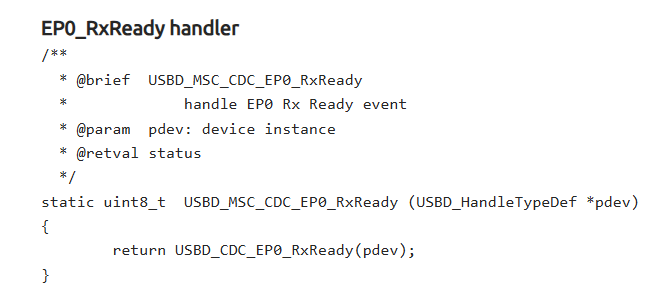

> Vì sao có hàm này: Mass Storage (MSC) không sử dụng EP0 để nhận thêm dữ liệu trong giai đoạn Control transfer (nó dùng bulk endpoint).

>Trong khi đó, CDC có thể sử dụng EP0 để nhận dữ liệu cấu hình từ host, ví dụ:
>
>- Set Line Coding (thay đổi baudrate, parity, stopbit,...)
>
>- Control Line State

- Bước 13: 

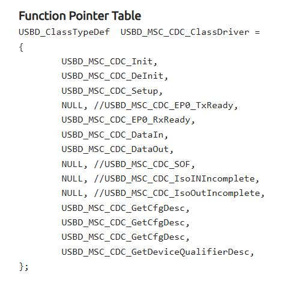

so sánh với

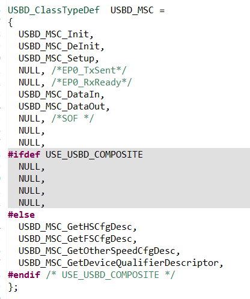

> Cấu trúc USBD_ClassTypeDef USBD_MSC_CDC_ClassDriver bạn đang dùng là bảng hàm (function pointer table) để đăng ký với USB Device Core trong STM32 USB Device Library. Đây chính là nơi liên kết driver lớp (class driver) của bạn với USB core của ST, để nó biết gọi hàm nào khi xử lý các sự kiện USB.

- Bước 14: thay bằng code này 

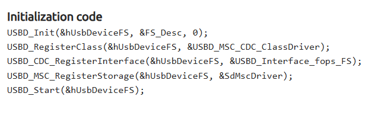

so với trước đó

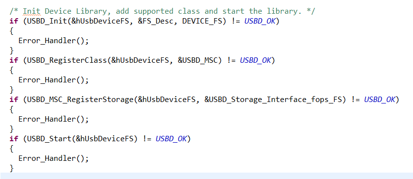

> chưa xem giải thích rõ.

- Bước 15: (usbd_def.h)

Đây là struct cơ bản của `USBD_HandleTypedef` chỉ dùng đối với USB đơn chức năng, đối với USB composite thì có vấn đề USB Stack của STM32 chỉ cung cấp một con trỏ duy nhất `pdev->pClassData` cho dữ liệu của class, dẫn tới:

Khi class CDC hoạt động → ghi vào `pClassData`.

Khi class MSC hoạt động → cũng ghi vào `pClassData`.

👉 Xung đột dữ liệu, đặc biệt khi 2 class được gọi xen kẽ trong các callback như DataIn, Setup, EP0_RxReady...

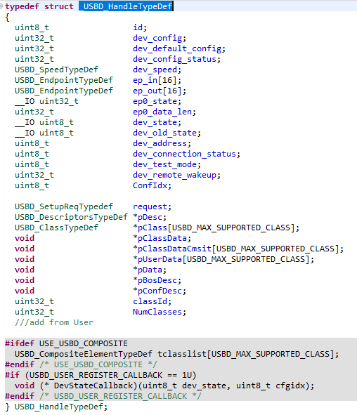

vì vậy, có một số giải pháp cho điều này nhưng tác giả đề xuất 

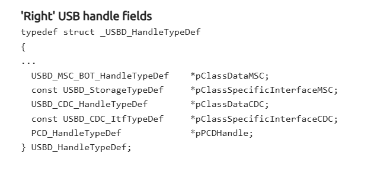
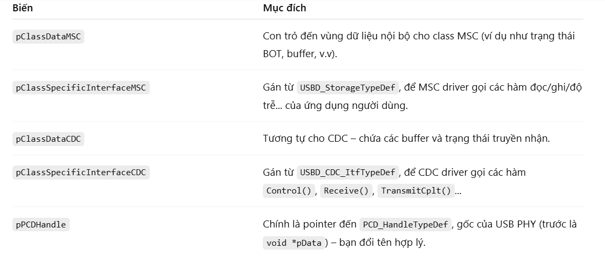

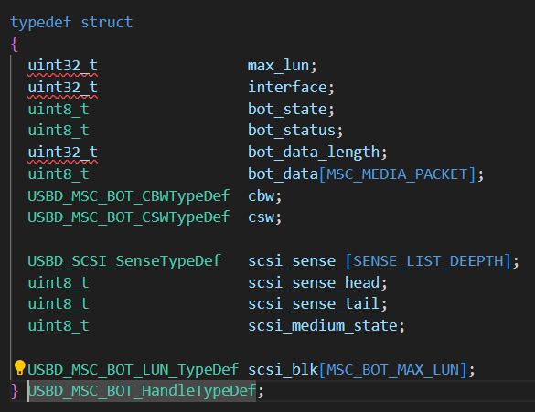
Đây là handle chính dùng trong Mass Storage Class (MSC) với giao thức Bulk-Only Transport (BOT). (trong usbd_msc.h)

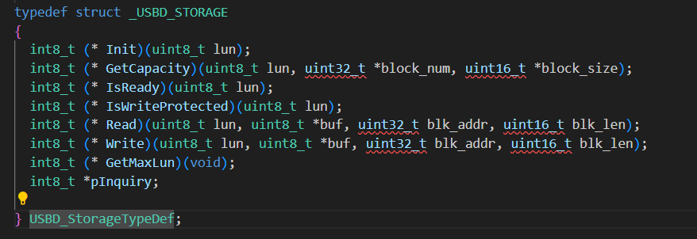
Đây là API trung gian giữa USB và phần cứng lưu trữ thật sự. Bạn cần gán struct này vào USBD_MSC_RegisterStorage() để STM32 gọi các hàm bạn cung cấp khi host yêu cầu đọc/ghi USB.

Tương tự với CDC 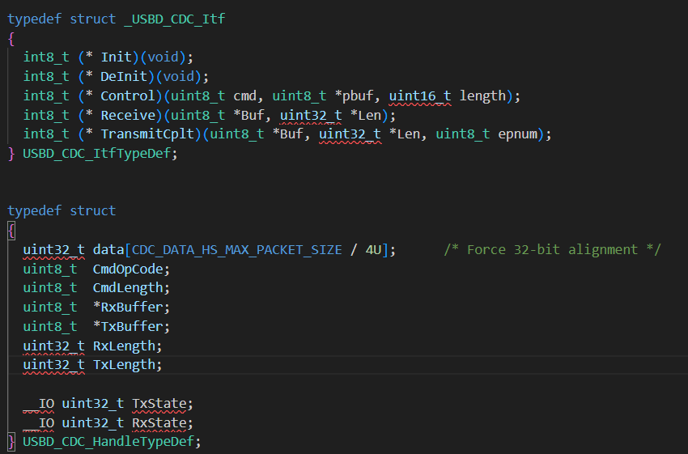. 1 Struct handle nội bộ của CDC – quản lý trạng thái gửi/nhận, buffer để quản lý trạng thái của giao tiếp CDC giữa Host ↔ STM32. Và 1 struct con trỏ USBD_CDC_ItfTypeDef này để stack gọi lại (callback) tương ứng( giống API mà đac nói trên MSC)

> Ưu điểm: Khi bạn làm composite dài hạn, có thể chỉnh sửa USB core,rõ ràng, tối ưu, dễ maintain nhưng phải sửa nhiều file hệ thống.
>
> **Nếu bug thì phải xem xét các vấn đề sau:**
Trong mỗi hàm Init, DeInit, DataIn, DataOut, Setup... thay vì dùng: `pdev->pClassData` thì đổi thành `pdev->pClassDataMSC` hoặc `pClassDataCDC`. Tương tự với `pdev->pUserData → pClassSpecificInterfaceXXX`
>
> Thêm nữa là phải cập nhật 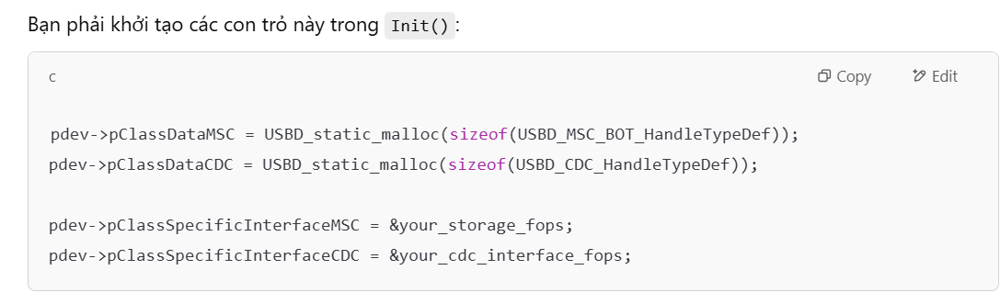.
>
> **Nếu không bug thì thôi**, tránh động sâu vào USB, ảnh hưởng đến các phần khác trong usbd_core.c vì hiện tại vẫn giữ nguyên `pClassData` trong struct này như trước, và dùng chỉ thêm dùng riêng `pClassDataMSC/CDC`.

 ***Lưu ý: `BUG` này***
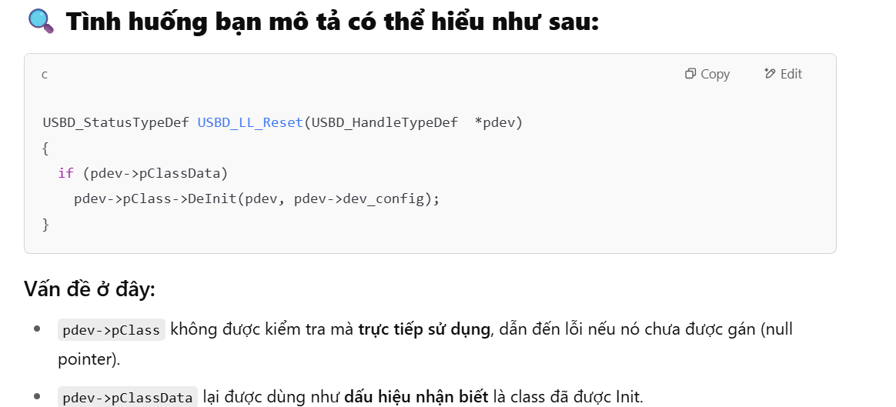

> Ở đây tác giả dùng `pClassData` để nhận biết `pClass` đã được init hay chưa vì không nên kiểm tra pdev->pClass == NULL trong runtime (vì đôi khi nó luôn luôn được gán tại USBD_RegisterClass, hoặc có thể là mảng pClass[classId] trong multi-class).
> 
> Để tránh lỗi luôn kiểm tra pClassData trước khi gọi vào pdev->pClass->XYZ(), nếu không chắc class đã được khởi tạo.

**bug có thể xảy ra với code trên**
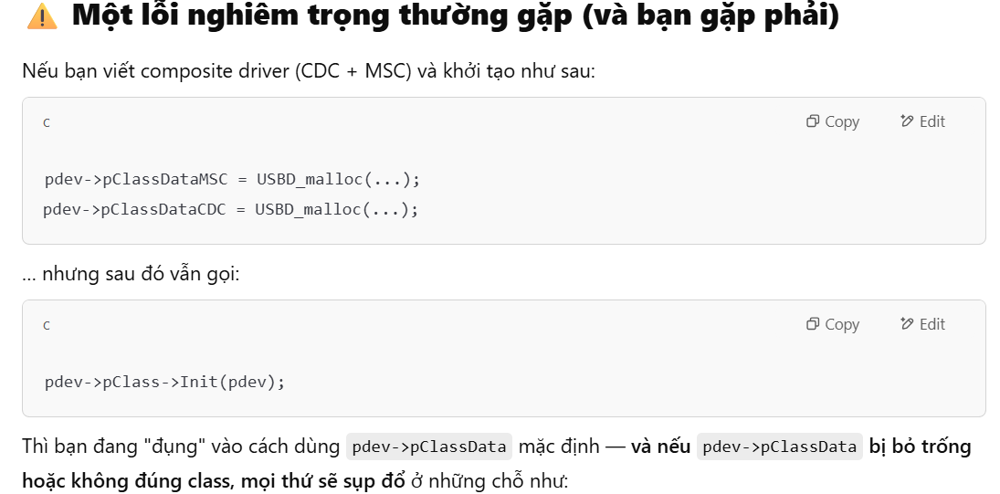
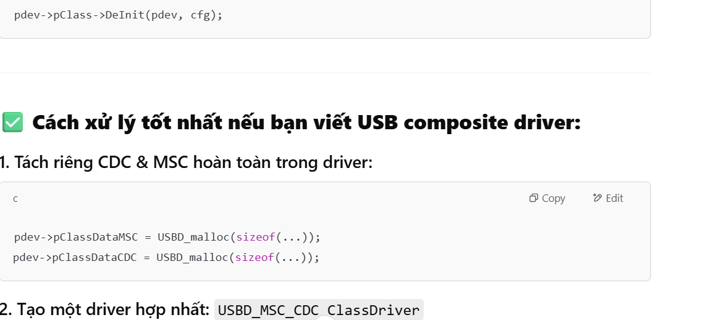
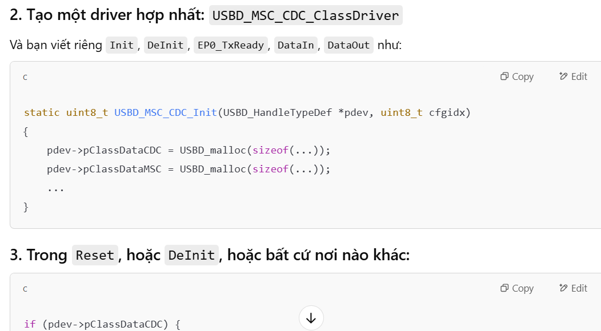
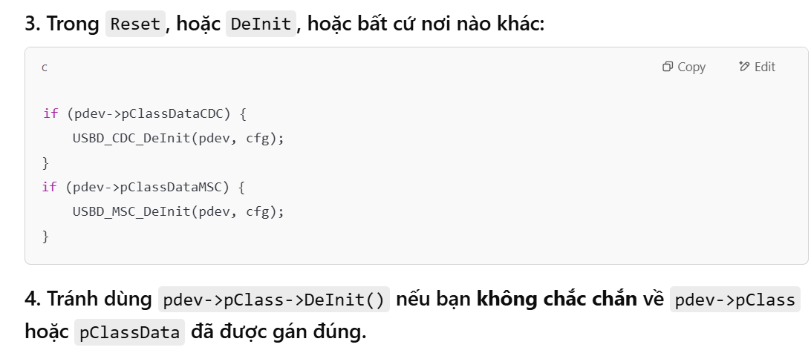

- Bước 16: Trong các class như CDC, hàm USBD_CDC_Init() sẽ gọi pdev->pClassData = USBD_malloc(...) để xin vùng nhớ dùng riêng.Trong thư viện STM32, USBD_malloc() mặc định là malloc() trong C.

Một số ví dụ (kể cả của ST) dùng kiểu cấp phát tĩnh (static allocation) thay vì malloc:
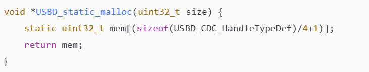
Cách này chỉ an toàn khi có 1 class, vì nếu có nhiều class (CDC + MSC), tất cả sẽ dùng chung 1 vùng → xung đột dữ liệu.

Vì vậy, tốt nhất là dùng cấp phát tĩnh riêng biệt cho từng class. Ví dụ, bạn tự tạo biến cdcInstance, rồi gán nó vào pClassDataCDC:
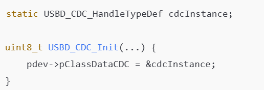
 Chốt lại ở bước này sửa cả MSC, và CDC phần Init chỗ thành pClassDataCDC/pClassDataCDC đồng thời cũng đề phù hợp vaoiws struct ở bước 15.

 **Chưa sửa xong 1**

- Bước 17: sửa code bộ nhớ đệm của endpoint trong usbd_conf.c.

code tác giả
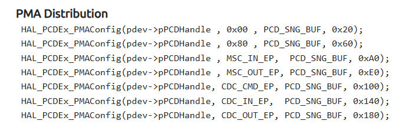

đây là bảng BTABLE

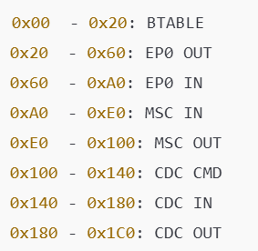

và **đã sửa nhưng không đảm bảo**, ep0 chưa được đề cập, RX làm sao nhận diện EP OUT 1 và OUT 3

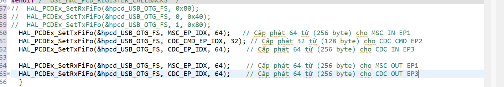

- Bước: **chưa động vào**

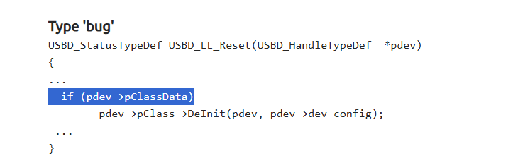

#### 4. Tự sửa thêm:

- đã sửa packet size (64U) trong device descriptor.
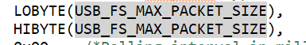

- `uint8_t *USBD_MSC_CDC_GetCfgDesc (uint16_t *length);` `uint8_t *USBD_MSC_CDC_GetDeviceQualifierDesc (uint16_t *length)` tạm thời đang copy y chang MSC.

Tác giả sửa vầy: 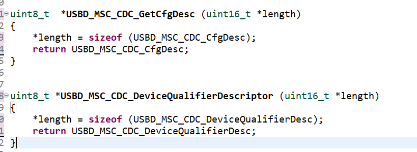

> **2 hàm quan trọng nha:** 2 hàm này sẽ chịu trách nhiệm gọi descriptor của thiết bị để cung cấp cho host

#### 5. USB Composite (CDC + HID):

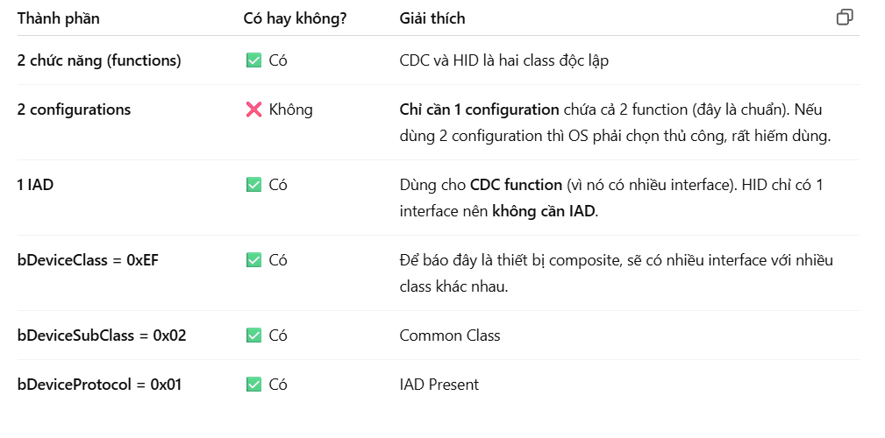
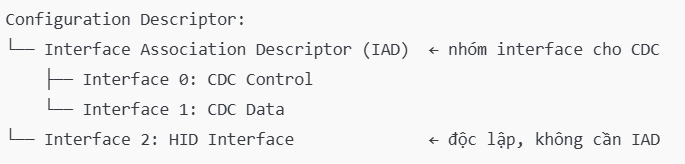