### I. Communicate protocol

#### 1. USB Architecture:
 https://www.circuitbread.com/tutorials/how-usb-works-introduction-part-1

- Là giao thức nối tiếp, bất đồng bộ (master-salve).
- Chỉ 1 master(host/upstream component) trong giao tiếp, slave(device/downstream component).

> Host bao gồm:
>- Host controller: Là một chipset phần cứng có trình điều khiển phần mềm chịu trách nhiệm phát hiện các thiết bị mới, quản lý dữ liệu, nguồn điện và mọi hoạt động trên bus.
>- Root Hub: phần cứng chủ yếu cung cấp điểm khởi đầu.

- mối thiết bị trong giao tiếp USB có 1 địa chỉ. Giới hạn 7bit địa chỉ (127 kết nối).
- không có máy tính nào có 127 cổng kết nối, nên để kết nối nhiều hơn số lượng thiết bị cần external hub. external hubcó thế kết nối với root hub. Hub không có khả năng lưu trữ nào và nó chỉ lặp lại của những thông tin trong quá trình truyền.

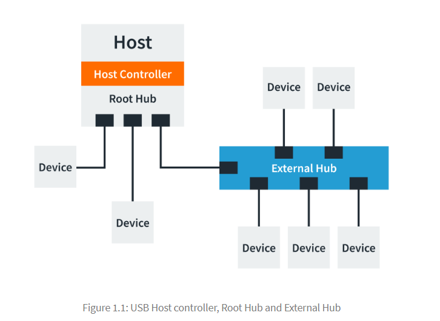

- Được cho phép tối đa 7 tầng:
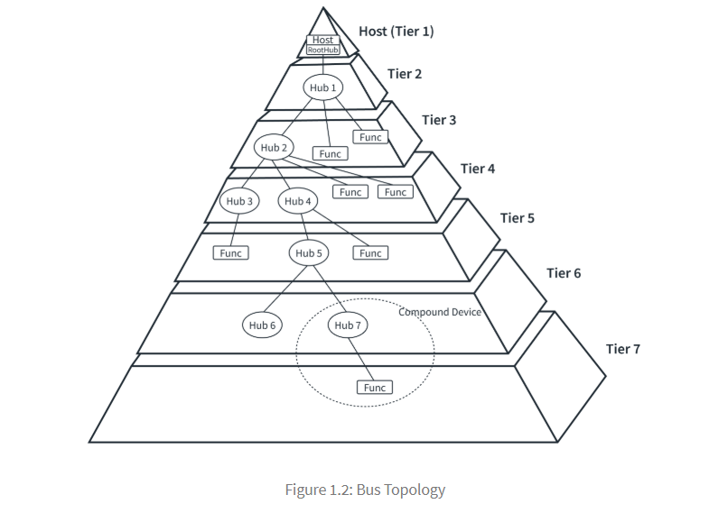

#### 2. Physical interface:

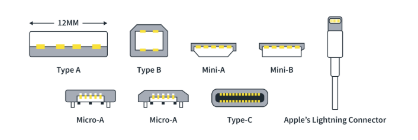

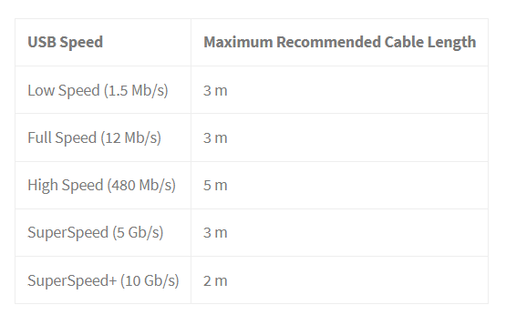

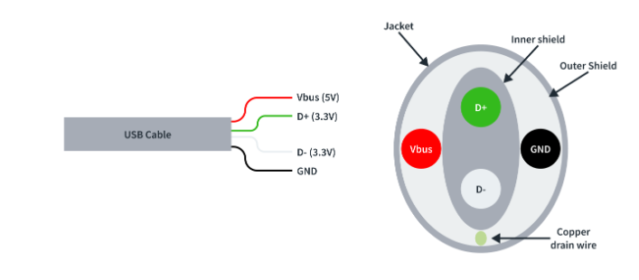

- cách mã hóa của NRZI-S: mức 0 thì chuyển mức logic tín hiệu, múc 1 thì giữ nghuyên. Vì vậy sử dụng băng thông hiệu quả.

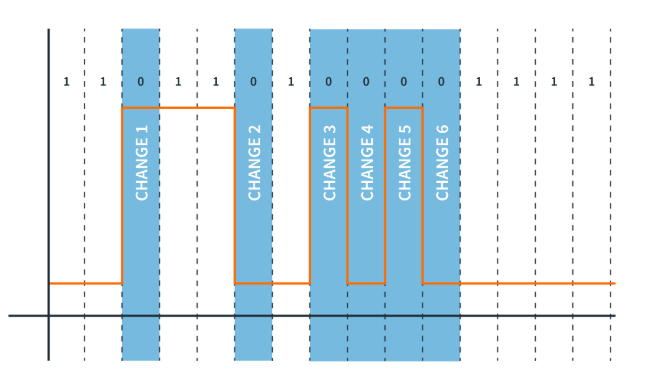

- Nhồi bit(Bit Stuffing):
Mặc dù mã hóa NRZI giúp sử dụng băng thông hiệu quả nhưng lại gây ra các vấn đề về đồng bộ hóa. Nếu có chuỗi 1 dài, máy thu có thể gặp khó khăn trong việc duy trì đồng bộ hóa bit chính xác, dẫn đến lỗi tiềm ẩn.

- Nhồi bit được thực hiện để giải quyết vấn đề này. Các quy tắc của kỹ thuật này rất đơn giản: chúng ta cần chèn một bit có cực ngược sau một tập hợp N số bit giống nhau để duy trì đồng bộ hóa. Trong USB, nhồi bit được thực hiện bằng cách chèn một bit có giá trị ngược (0) sau sáu bit nhị phân 1 liên tiếp.
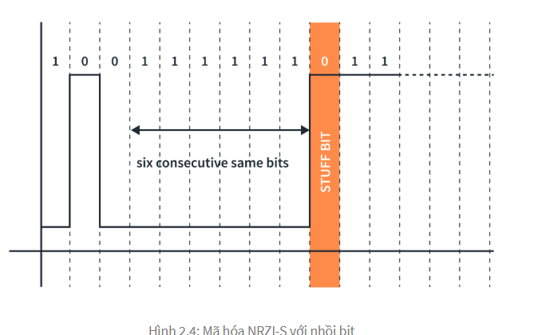

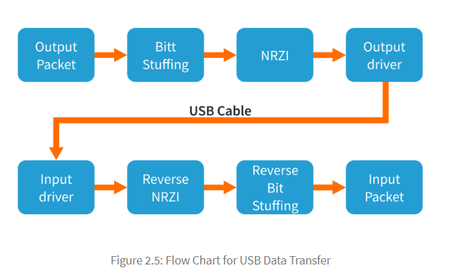

#### 3. Data Transmission:
- Truyền dữ liệu trong giao thức USB được thực hiện bằng tín hiệu cặp vi sai; bus có các đường D+ và D- hoạt động ở mức 3,3V.

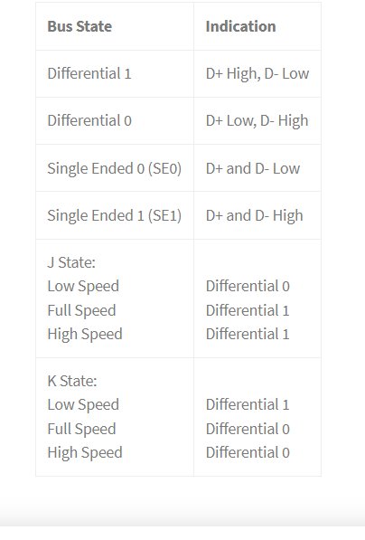

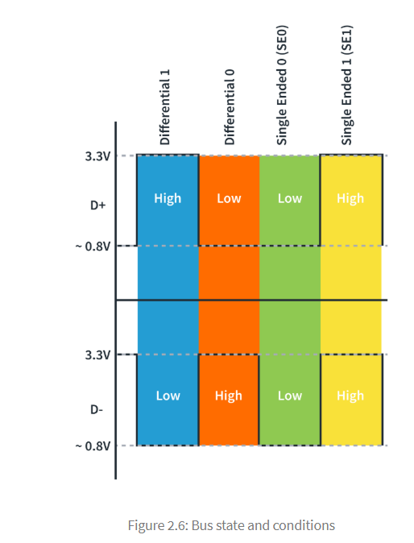

> một số thiết bị như cổng PS/2 không thể cắm nóng (hot phugged - là cắm bất kì lúc nào mình muốn) mà chỉ có thể cắm trước khi khởi động máy tính.

#### 4. USB Endpoints:

- một thiết bị USB là 1 tập hợp các endpoints.

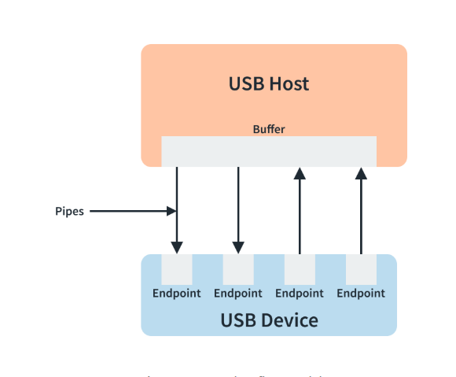

- USB có 32 điểm cuối bao gồm 16 điểm cuối IN và 16 điểm cuối OUT, có thể truy cập sau khi cấu hình ban đầu. 
> USB định nghĩa 4 loại truyền:
>- Control transfers :
>- Interrupt Endpoints:
>- Bulk Endpoints:
>- Isochronous Endpoints:

#### 5. Communication:

- Giao thức USB 2.0 là bán song công.
 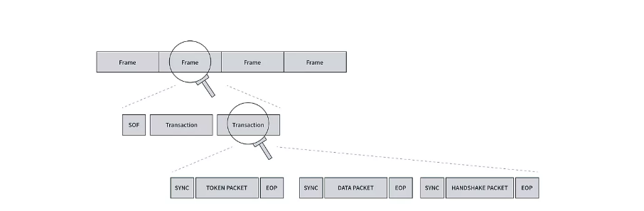

 - Một packet chứa những thông tin sau:
 > Packet ID: định nghĩa loại packet. Kích thước 8 bit. 4 bit đầu là bit loại, 4 bit sau check lỗi.
 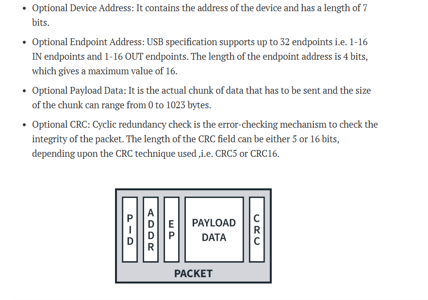

 - Đẻ bắt đầu truyền dữ liệu trên bus, đường bus sẽ được chuyển sang K state. Một mẫu đồng bộ được gửi bao gồm 8 trang thái(3KJ và KK). Theo sau là packet data: packet ID, payload, packet EOP.

 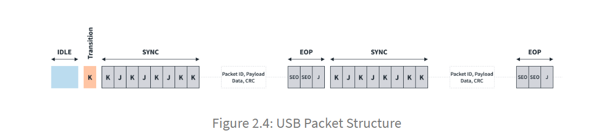

 - Có hỗ trợ cho bốn loại gói tin khác nhau trong thông số kỹ thuật USB 2.0:
 
 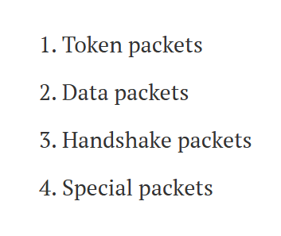

 ##### 5.1 Token Packets:

 - Token Packets: được khởi tạo bởi Host, dùng để định hướng lưu lượng trên bus, quyết ddingj laoij giao dịch giứa Host và device.
 - Bao gồm: 1 packet ID, 7-bit device address, 4-bit endpoint ID, and 5-bit CRC.
 - Có 3 loại token packet:
 > - IN token packet: yêu cầu device cung cấp data cho Host.
 > - OUT token packet:thông báo cho device là Host chuẩn bị gửi data.
 > - SETUP token packet: được tạo ra trong suốt quá trình setup và cấu hình thiết bị.

- SOF token packet: được tạo ra để bắt đầu 1 khung mới. Lfa packet đạt biệt, chứa 11 bit cho biết tổng số frame được truyền.
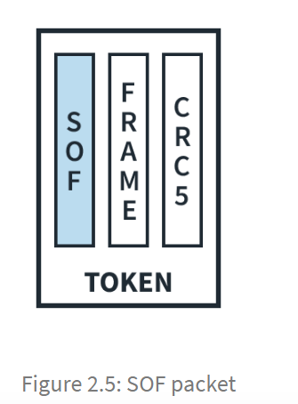
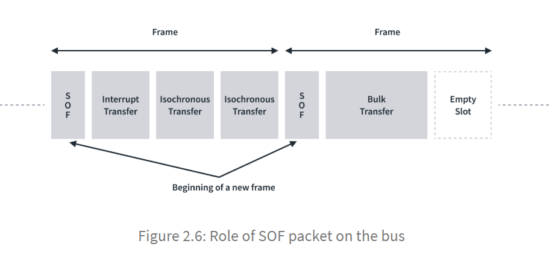

 ##### 5.2 Data Packets:

 - Được yêu cầu hoặc hoặc gửi bởi Host bao gồm: a packet ID, payload data, and CRC16 field.
 - Hỗ trợ 2 loại packet ID: DATA 0 và DATA 1. Lí do có 2 loại là vì khi gửi nối tiếp nhau thì nó sẽ tư động toggle gói, giúp nhận diện khi lỗi mất gói tin. Payload có kích thước là 0-1024 bytes.

 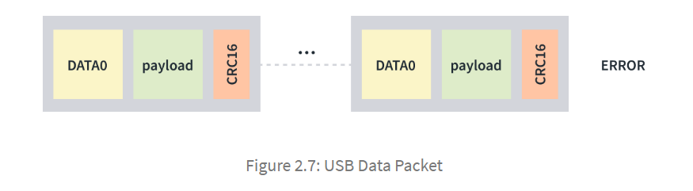

##### 5.3. Handshake Packets:

- Dùng đẻ kết thúc mỗi giao dịch bao gồm 8 bit được gửi bới bên nhận.

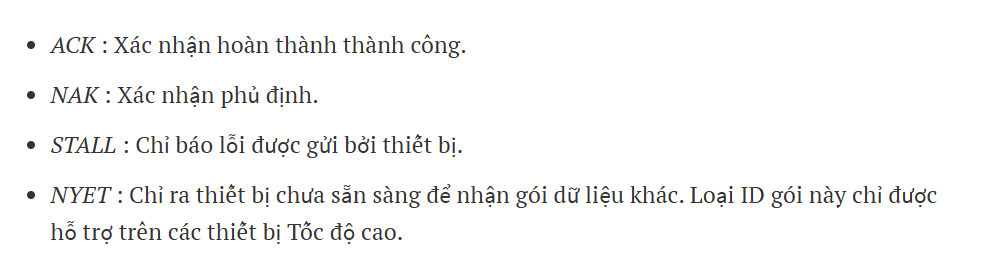

##### 5.4. Special Packets:

- PRE: Tin nhắn này được máy chủ gửi đến các hub để báo hiệu gói tin tiếp theo có tốc độ thấp khi sử dụng thiết bị tốc độ cao hoặc đầy đủ.

- PING : Chỉ khả dụng trên các thiết bị tốc độ cao, được sử dụng để kiểm tra trạng thái của thiết bị USB sau khi nhận được gói tin NYET.

**Tổng kết**

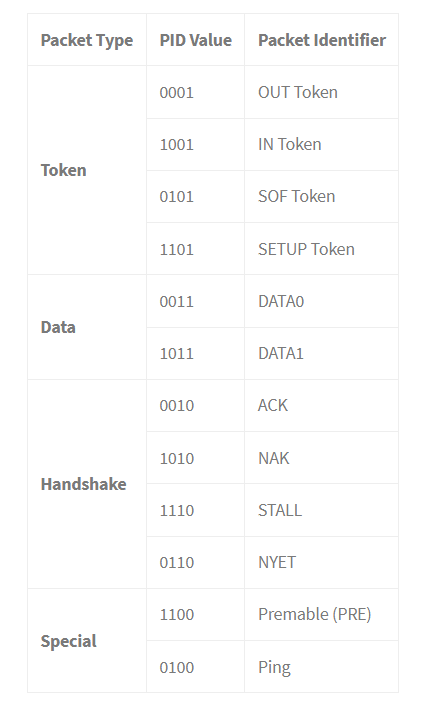

#### 6. Types of Transactions (các loại giao dịch):

- Upstream Transactions: gửi từ device đến host. ĐƯợc khởi tạo bởi host yêu cầu data từ device bằng IN token packet. Device gửi và được host phản hồi bằng handshake packet.

- Nếu device chưa sãn sàng thì gửi host NAK.

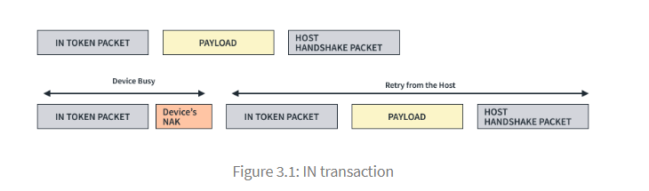

- Downtream Transactions: ngược lại với upstream.

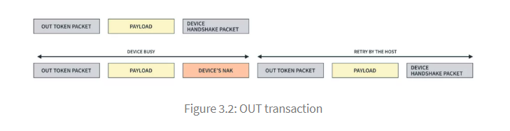

- Control Transactions:

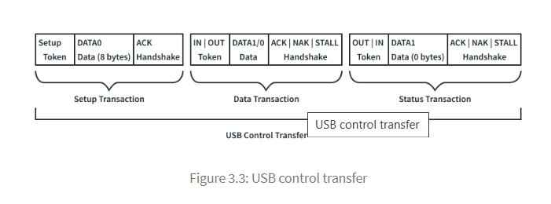

### II. Enumeration and Configuration:

- Standard requests: Chúng thực hiện các tác vụ thiết yếu như lấy thông tin thiết bị, thiết lập cấu hình và kiểm tra trạng thái.

- Class requests: Đây là những yêu cầu dành riêng cho một lớp thiết bị cụ thể .

- Vendor requests: Được nhà sản xuất thiết bị xác định và cho phép kiểm soát và tính năng cụ thể của nhà cung cấp.

#### 1. Types of Descriptors:

**USB descriptor** dùng để chỉ các gói thông tin nhỏ hoạt động như thẻ nhận dạng cho thiết bị. Các descriptor này giống như hướng dẫn sử dụng được đóng gói trong chính thiết bị và chúng cho máy chủ biết mọi thứ cần biết về thiết bị để giao tiếp và sử dụng đúng cách.

##### 1.1. Device Descriptor:

- Khi cắm USB vào, host biết thiết bị mình đang cần tương tác là gì thì host sẽ gửi yêu cầu đầu tiên để biết device descriptors(gói được mô ta như sau).

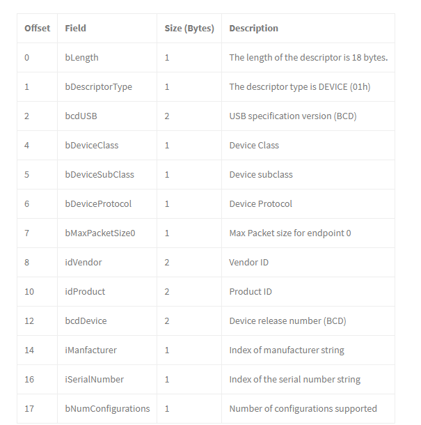

>- bLength : Là tổng chiều dài tính bằng byte của bộ mô tả thiết bị.
>- bcdUSB: Đây là giá trị thập phân được mã hóa nhị phân sử dụng định dạng 0xAABC, trong đó A là số phiên bản chính, B là số phiên bản phụ và C là số phiên bản phụ để đưa ra báo cáo về phiên bản USB của thiết bị, giúp máy chủ tải trình điều khiển cần thiết. Ví dụ: USB 1.1 sẽ có giá trị là 0x0110.
>- bDeviceClass, bDeviceSubClass và bDeviceProtocol được máy chủ sử dụng để xác định trình điều khiển cho thiết bị USB trong quá trình liệt kê. Hầu hết các thiết bị USB định nghĩa các lớp của chúng trong trình mô tả giao diện và để các trường này là 00h.
>- bMaxPacketSize báo cáo số lượng gói tin tối đa được Endpoint 0 hỗ trợ. Tùy thuộc vào thiết bị, kích thước có thể là 8 byte, 16 byte, 32 byte và 64 byte.
iManufacturer, iProduct và iSerialNumber là các chỉ số cho các mô tả chuỗi. Các mô tả chuỗi cung cấp thông tin chi tiết về nhà sản xuất, sản phẩm và số sê-ri. Nếu các mô tả chuỗi tồn tại, các biến này phải trỏ đến vị trí chỉ mục của chúng. Nếu không tồn tại chuỗi nào, thì trường tương ứng phải được gán giá trị bằng không.
>- bNumConfigurations xác định tổng số cấu hình mà thiết bị có thể hỗ trợ. Nhiều cấu hình cho phép thiết bị được cấu hình khác nhau tùy thuộc vào các điều kiện nhất định, chẳng hạn như được cấp nguồn qua bus hoặc tự cấp nguồn.

**1.2. Configuration Descriptor, Interface Association Descriptor (IAD), Interface Descriptor, Endpoint Descriptor, String Descriptor tự đọc:** https://www.circuitbread.com/tutorials/how-usb-works-enumeration-and-configuration-part-3

#### 2. USB Enumeration and Configuration:

Khả năng cắm bất kì lúc nào tùy thích của USB (hot-pluggable USB) được thwucj hiện theo 3 bước:

##### 2.1. Dynamic Detection:

- host controller sẽ giám sát các cổng USB trên D+ và D-. KHi phát hiện thiết bị mới kết nối, nó sẽ xác định tốc độ của thiết bị như đã nêu ở trên. Sau đó, nó reset thiết bị bằng các kéo D+ D- xuống mức thấp bằng trở kéo xuống của host.
(ở đây nếu device có thế giao tiếp tốc độ cao sẽ có động thái “KJKJKJ” gì gì đó, còn nếu không có động thái thì sẽ hoạt động ở Full-Speed)

- Ở đây host nó xác định tốc độ giao tiếp bằng cách xác ddingj mức logic trên D+ và D-. Device cho biết tốc độ giao tiếp bằng cách dùng trở kéo lên ở chân D+/D-.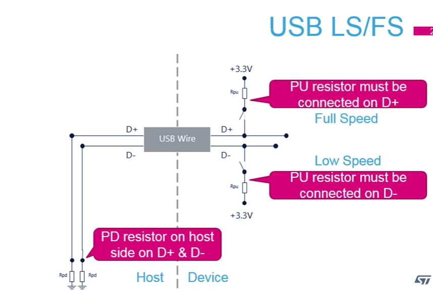

##### 2.2. Enumeration Configuration:

- Sau khi có thông tin về speed, nó sẽ bắt đầu giao tiếp vi=ới device thông qua endpoint(EP0) trên địa chỉ mặc định 00h. Tại 1 thời điểm chỉ có 1 thiết bị có địa chỉ này.

- Host gửi GET_DESCRIPTOR command đến device để nhận device descriptor, từ đó xác định kích thước gói tin tối đa được hỗ trở bới endpoint (từ 0 đen 8 byte của bMaxPacketSize0)

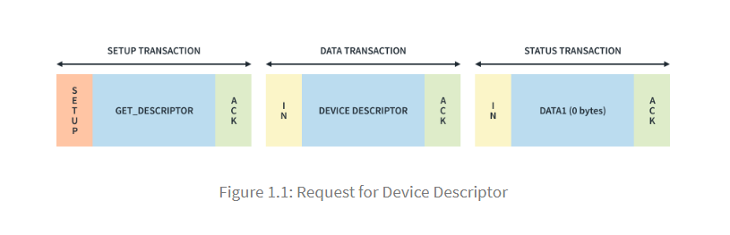

- Sau khi nhận device descriptor, host lại reset và gán địa chỉ mới cho thiết bị USB bằng cách gửi  SET_ADDRESS command sử dụng control transaction (mợi giao dịch từ đây sẽ sử dụng địa chỉ mới). Host lại gửi GET_DESCRIPTOR command sử dụng địa chỉ mới ddược gán, và lần này toàn bộ tất cả các bộ mô tả đều được đọc.

- Tiếp theo host sẽ thiết lập cấu hình cụ thể cho device bằng SET_CONFIGURATION request và host sẽ tải driver của device.

`Máy chủ sẽ tìm kiếm trình điều khiển để quản lý giao tiếp giữa chính nó và thiết bị. Máy Windows sử dụng các tệp .inf của nó để tìm một kết quả khớp với Product ID và Vendor ID của thiết bị.`

- Bây giờ thiết bị đã sẵn sàng được sử dụng. 

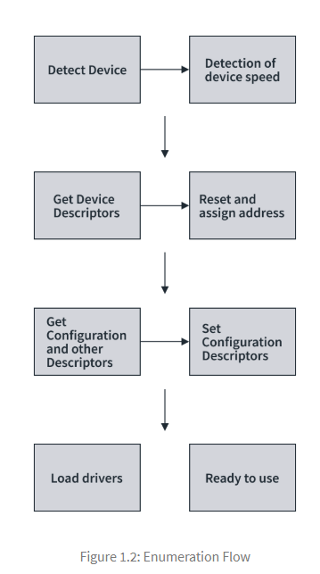

#### 3.USB Classes:

Các lớp USB đề cập đến các thông số kỹ thuật hoặc tiêu chuẩn khác nhau xác định khả năng và chức năng của các thiết bị và giao tiếp USB.

- Các lớp chuẩn được định nghĩa bởi các thông số kỹ thuật USB chính thức và dành cho các loại thiết bị phổ biến. Chúng tương thích với các hệ điều hành và thiết bị chủ khác nhau.

>- USB Human Interface Device (HID) : Lớp này được sử dụng cho các thiết bị như bàn phím, chuột, bộ điều khiển trò chơi và cần điều khiển. Nó cho phép hệ điều hành nhận dạng các thiết bị này mà không cần trình điều khiển bổ sung.
>- USB Mass Storage: Các thiết bị như ổ đĩa flash USB, ổ cứng ngoài và đầu đọc thẻ nhớ thuộc loại này. Chúng cho phép lưu trữ và truy xuất dữ liệu dễ dàng.
>- USB Audio: Lớp này được sử dụng cho các thiết bị âm thanh như loa, micrô, tai nghe và card âm thanh. Nó cho phép truyền dữ liệu âm thanh qua kết nối USB.
>- Video USB: Các thiết bị như webcam và máy ảnh kỹ thuật số chụp hoặc phát video sử dụng lớp này. Các thiết bị video USB thường tuân theo tiêu chuẩn lớp thiết bị video USB (UVC).
>- USB Printer: Máy in và các thiết bị đa chức năng hỗ trợ in, quét và fax thường tuân theo thông số kỹ thuật của loại máy in USB.
>- USB Communication Device Class (CDC) : Lớp này bao gồm các thiết bị như modem, cổng nối tiếp và bộ điều hợp mạng. Nó tạo điều kiện thuận lợi cho việc truyền thông giữa các thiết bị và máy chủ.

**Vendor Specific Classes :** Các lớp dành riêng cho nhà cung cấp không phải là một phần của thông số kỹ thuật USB chính thức nhưng được các nhà cung cấp triển khai để cung cấp các chức năng hoặc tính năng chuyên biệt dành riêng cho sản phẩm của họ và cho phép các nhà sản xuất linh hoạt hơn trong việc thiết kế thiết bị của họ. Các lớp này có thể yêu cầu trình điều khiển hoặc phần mềm dành riêng cho nhà cung cấp để hoạt động bình thường và có thể không tương thích với tất cả các hệ điều hành hoặc thiết bị lưu trữ.

### III. Getting started with STM32 and USB:

https://wiki.st.com/stm32mcu/wiki/Introduction_to_USB_with_STM32#Speed

Các STM32 families hỗi trợ:
- Device in FS speed only.
- OTG (dual role: device and host) in FS speed.
- OTG in HS speed.

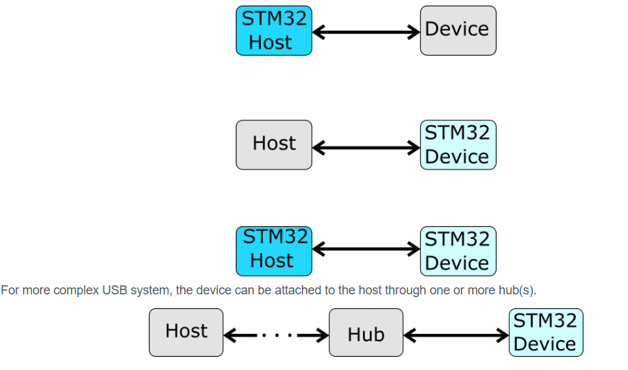

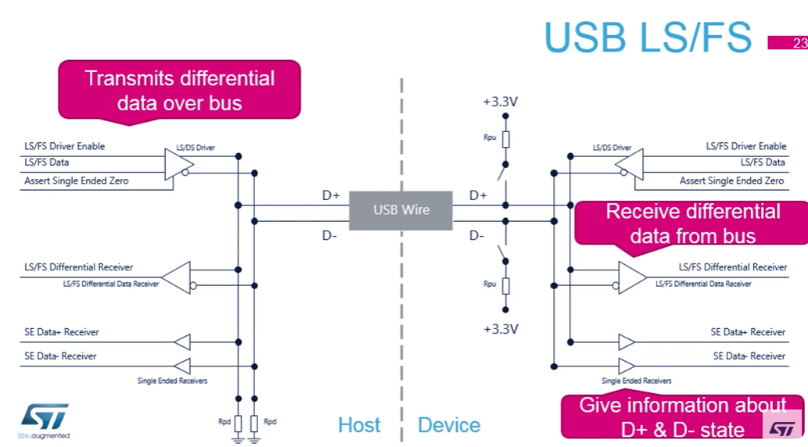

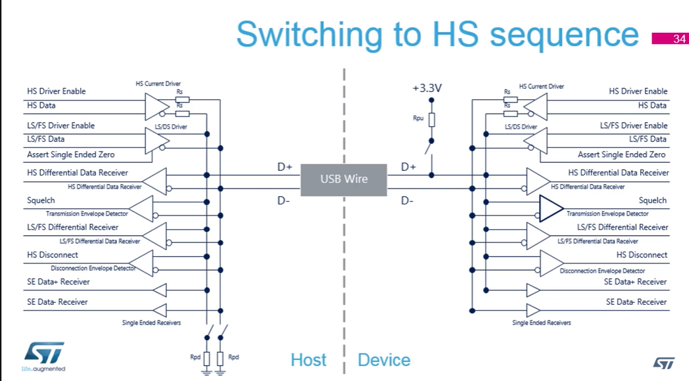

**“STM32_USB_Device_Library” bao gồm mô-đun “Core” cho các API điều khiển ngoại vi chuẩn của thiết bị USB và mô hình “Classes” cho các API lớp được hỗ trợ phổ biến.**

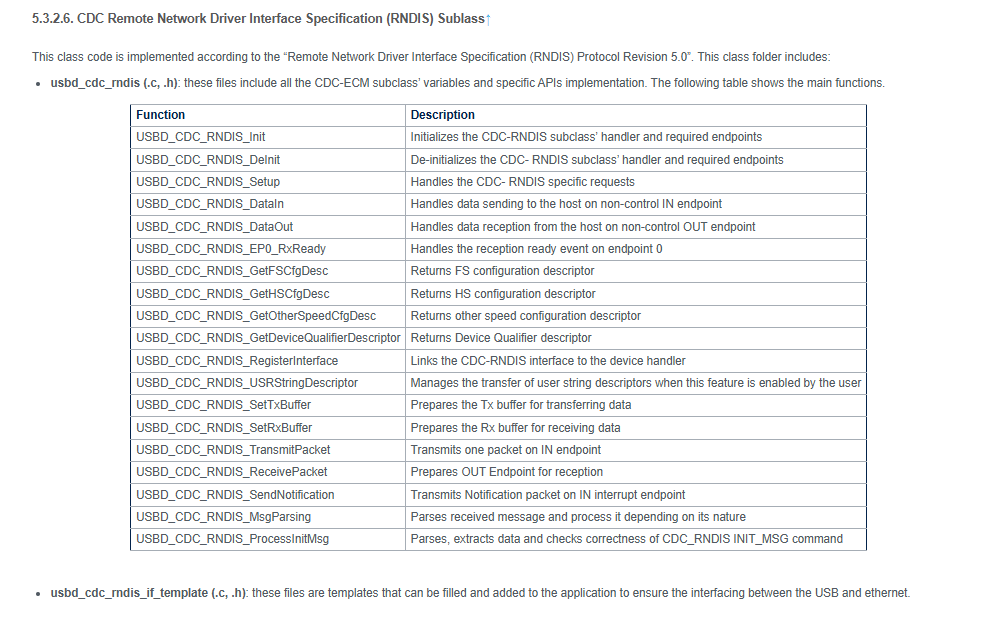

#### 1. Triển khai ứng dụng thiết bị USB:

- main (.c, .h): bao gồm các hàm và biến chính cần thiết cho ứng dụng.
- usb_device (.c, .h): chỉ tồn tại cho kiến ​​trúc ứng dụng nâng cao. Nó chứa tất cả các hàm và biến khởi tạo thiết bị USB. Đối với kiến ​​trúc ứng dụng cơ bản, việc khởi tạo được thực hiện trong main(.c, .h).
- stm32XXxx_it (.c, .h): XX đề cập đến thiết bị STM32 có thể là f4, f7, h7, wb, g4, l5...v.v. Nó bao gồm trình xử lý IRQ ngắt hệ thống và USB khác.
- usb_desc (.c, .h): bao gồm các định nghĩa mô tả và các hàm liên quan. Nó phụ thuộc vào class được chọn.
- usbd_conf (.c, .h): bao gồm GPIO và khởi tạo trình xử lý lớp thấp và định nghĩa lệnh gọi lại USB. Tùy thuộc vào phần cứng.
Trong tệp ứng dụng có thể là main.c hoặc usb_device.c, việc khởi tạo thiết bị USB chủ yếu được đảm bảo thông qua ba chức năng chính sau:

> - USBD_Init(): khởi tạo ngăn xếp thiết bị và tải trình điều khiển lớp.
> - USBD_RegisterClass(): liên kết trình điều khiển lớp với lõi thiết bị.
> - USBD_Start(): cho phép người dùng khởi động lõi thiết bị USB.

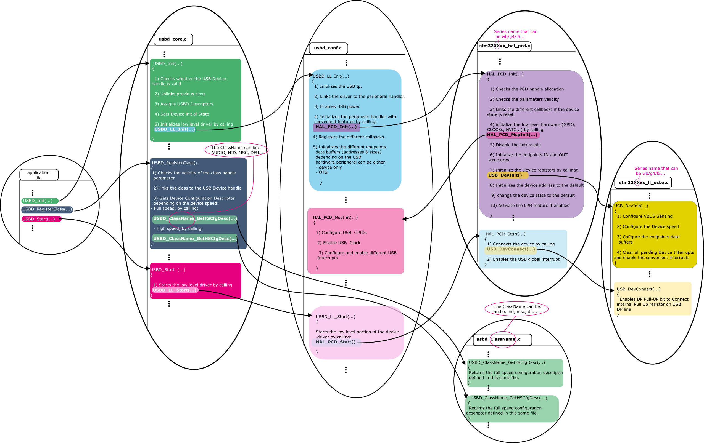

**`The STM32 USB device library` chứa `Core` bao gồm API chung cho tất cả STM32 USB class và ứng dụng, `Classes` gồm tất cả các API liên quan đến USB device hỗ trợ class.**

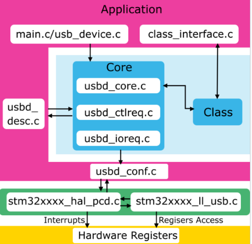

#### 2. Các mà code triển khai đối với USB:

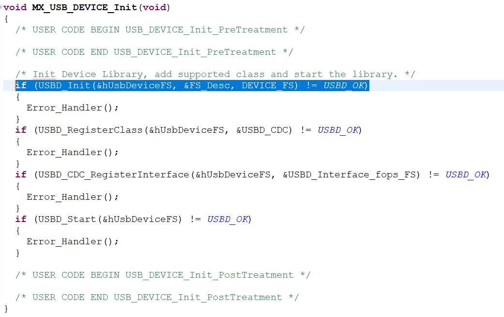

#### 3. USB Transfers:

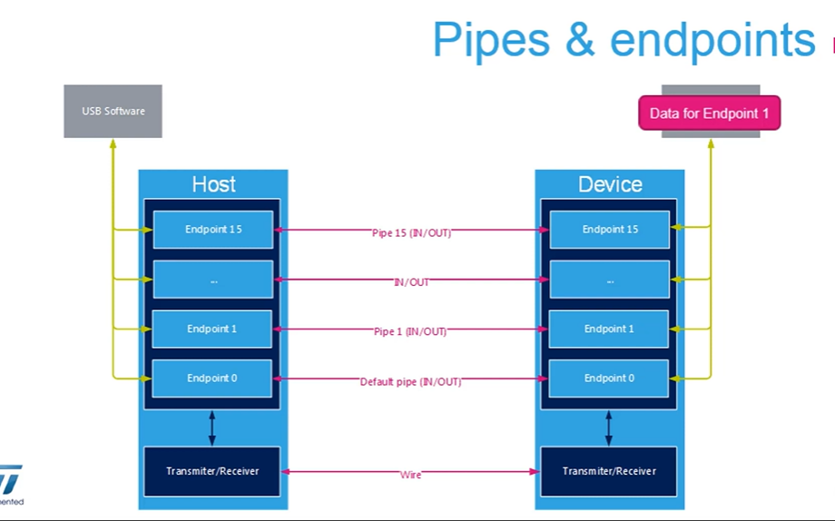

- Mỗi host/device có đa endpoint, ngoài endpoint 0 (dùng để cấu hình thiết bị), các endpoint khác được dùng để truyền/nhận dữ liệu. 

- một thiết bị USB có thể hỗ trợ tối đa 16 endpoint numbers.

- Pipe là kết nối logic từ host đến một endpoint cụ thể trên một thiết bị cụ thể. Pipe được xác định bằng Device address, Endpoint number và chỉ tồn tại dưới góc nhìn của Host để host biết cánh định tuyến dữ liệu đúng đén End point.

- Endpoint là virtual communitaion channel (kênh giao tiếp ảo) giũa device và host.

- Mỗi endpoint có thể có các loại giao dịch khác nhau: SETUP, BULK, iterrupt, Isochonous.

>- Control (SETUP):
Dùng cho cấu hình thiết bị (thường là endpoint 0). Bao gồm cả lệnh SETUP, IN, OUT.
Ví dụ: Host gửi yêu cầu Get Descriptor để lấy thông tin thiết bị.
>- Bulk:
Dùng để truyền dữ liệu lớn, không yêu cầu thời gian thực nhưng đảm bảo độ tin cậy.
Ví dụ: Truyền dữ liệu từ USB storage, in ấn.
>- Interrupt:
Dùng cho dữ liệu ít nhưng yêu cầu phản hồi nhanh và định kỳ.
Ví dụ: Bàn phím, chuột gửi tín hiệu khi có thao tác.
>- Isochronous:
Dùng cho truyền dữ liệu theo thời gian thực, có thể chấp nhận mất dữ liệu.
Ví dụ: Truyền audio/video từ webcam hoặc micro.

##### 3.1. Packet và Stucture:

- **Token packet:**
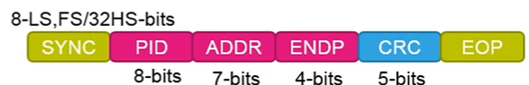
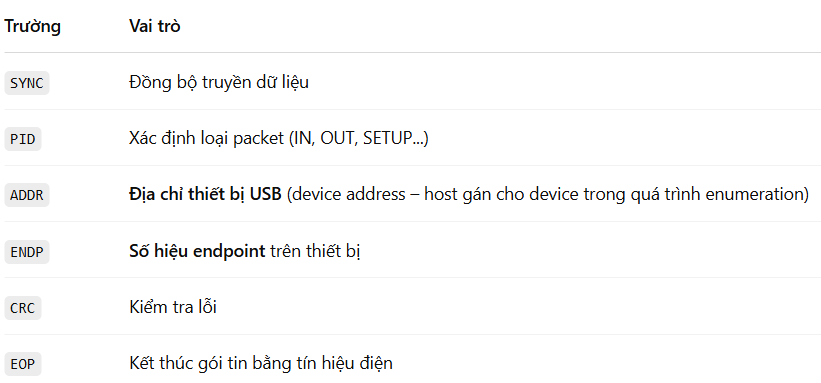

- **Start-of-Frame (SOF) Packet:** 

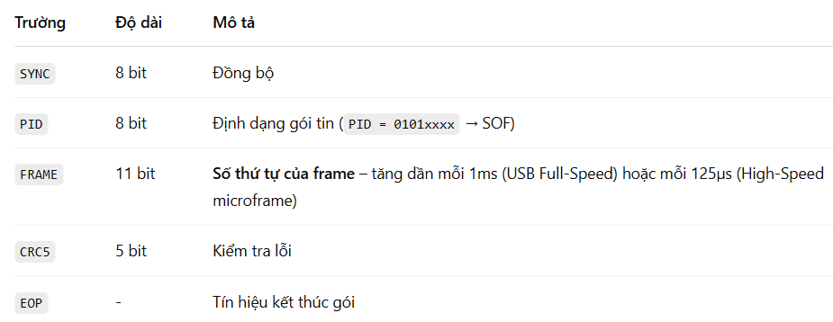
> Chu kỳ gửi SOF:
>- Low-Speed (LS) và Full-Speed (FS): SOF được gửi mỗi 1 ms (1 khung mỗi mili-giây).
>- High-Speed (HS): SOF được gửi mỗi 125 µs (8 khung mỗi mili-giây, gọi là micro-frame).

- **Data packet**

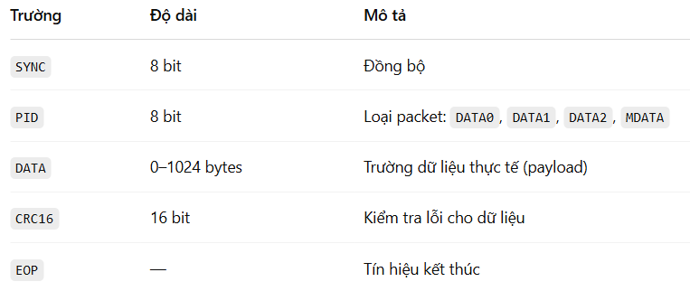

- **Transaction Handshake packet**

    ACK (Acknowledge): Thiết bị nhận (receiver) xác nhận đã nhận được gói dữ liệu không có lỗi (error-free).

    NAK (Negative Acknowledge): Thiết bị nhận không thể xử lý dữ liệu (ví dụ: bộ đệm đầy) hoặc thiết bị gửi không có dữ liệu để gửi (ví dụ: FIFO rỗng). NAK yêu cầu host thử lại giao dịch sau, không coi là lỗi nghiêm trọng.

    STALL: Endpoint bị tạm dừng (halted) hoặc yêu cầu điều khiển (control pipe) không được hỗ trợ. STALL báo hiệu lỗi nghiêm trọng hơn NAK, thường yêu cầu host can thiệp

    NYET (Not Yet): Chỉ dùng trong USB High-Speed (HS). Thiết bị nhận báo rằng chưa sẵn sàng trả lời (chưa hoàn tất xử lý). Thường dùng trong giao dịch bulk hoặc control để trì hoãn mà không từ chối giao dịch.

    Missing handshake: Không có gói bắt tay trả về từ thiết bị nhận, thường do lỗi truyền (như CRC sai) hoặc thiết bị không phản hồi.

- **Acknowledge packet**

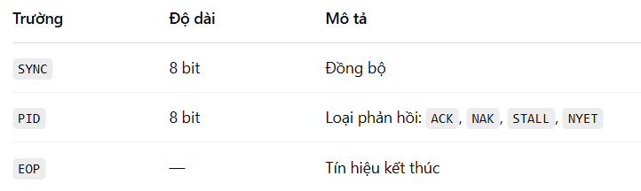

##### 3.2 Bulk transaction:
 
`Khung màu xanh đậm của Host, còn màu xanh nhạt là của device. Áp dụng cho all các sơ đồ trong mục này. `

Thường được dùng cho các ứng dụng không yêu cầu thời gian thực, nhưng cần truyền lượng dữ liệu lớn và đảm bảo độ tin cậy(file, máy in, máy quét hình ảnh, modem hoặc thiết bị mạng)

 1. Bulk transaction IN: 

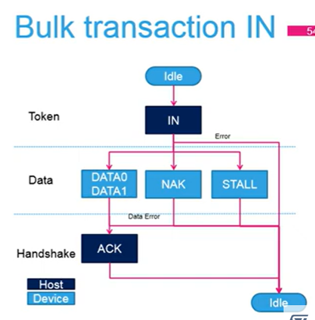
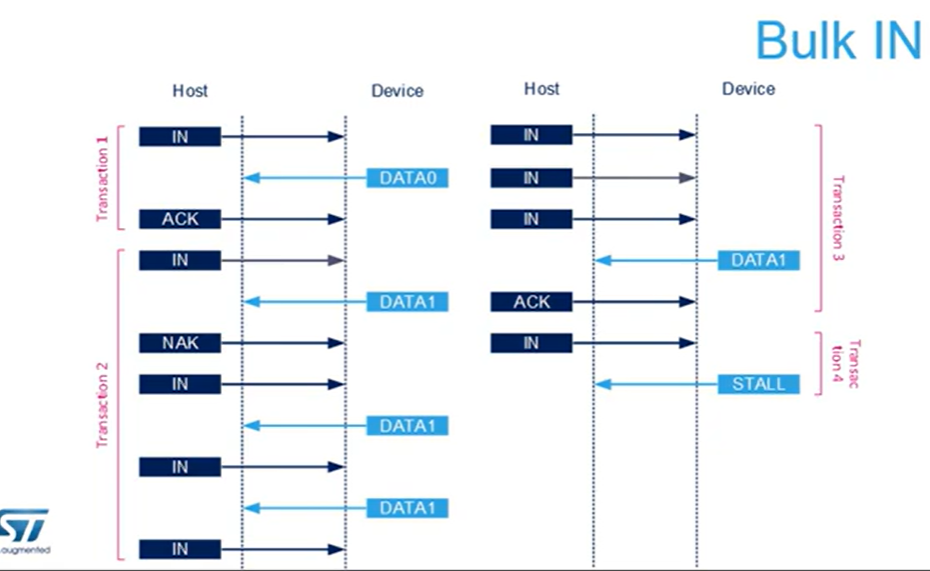

- Bulk Transaction IN là quá trình host yêu cầu dữ liệu từ thiết bị USB. Host gửi gói IN, thiết bị phản hồi bằng DATA0 hoặc DATA1, và host gửi ACK nếu nhận thành công. Nếu có lỗi, thiết bị có thể trả NAK (chưa sẵn sàng) hoặc STALL (lỗi nghiêm trọng). Giao dịch này dùng để truyền dữ liệu lớn, không yêu cầu thời gian thực và chỉ thực hiện nếu còn băng thông.

 2. Bulk transaction OUT: 
 
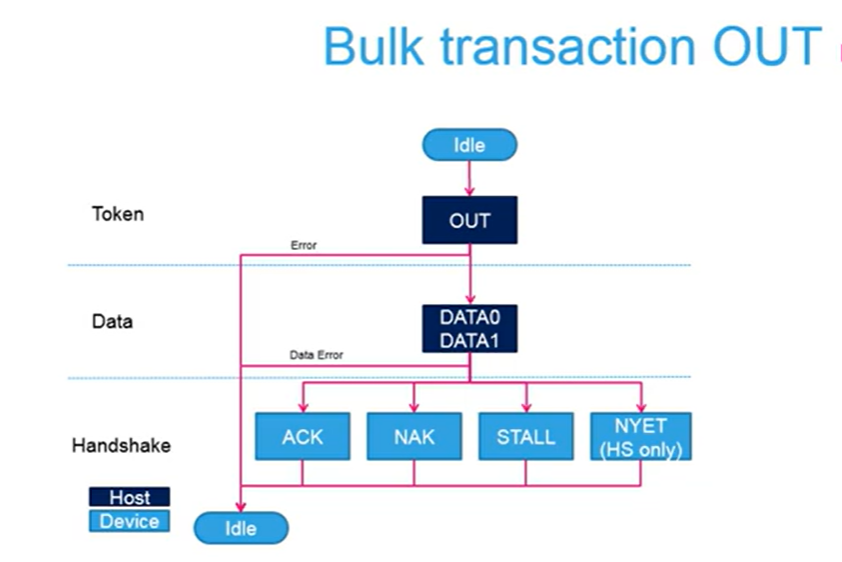
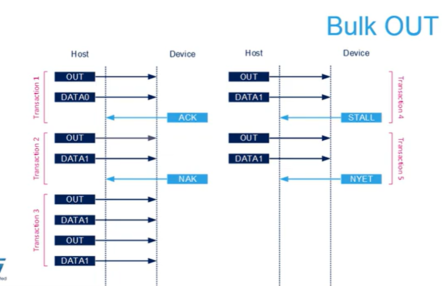

##### 3.3 Isochronous Transaction(Giao dịch theo thời gian thực):

Dùng cho ứng dụng thời gian thực(phát âm thanh (audio playback), video streaming), Cung cấp dữ liệu đúng thời điểm. Lỗi chỉ được phát hiện (detected) chứ không thử lại

Chỉ có ở Full-Speed và High-Speed.

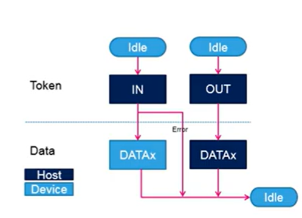
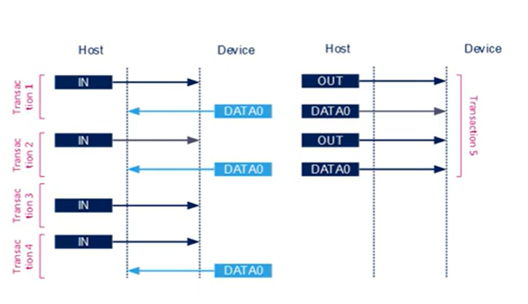

##### 3.4 Interrupt Transaction:

 Dùng cho các thiết bị ngắt:
Ví dụ: chuột, bàn phím – gửi dữ liệu khi có thay đổi. Phù hợp với lượng dữ liệu nhỏ. Tần suất kiểm tra (polling interval):Thường từ 1ms trở lên.
 
 Hỗ trợ mọi tốc độ USB:
LS (Low), FS (Full), HS (High Speed) đều có thể dùng.

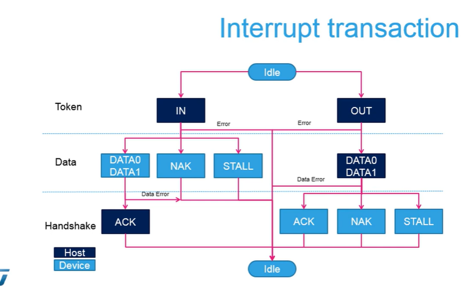

Trông có vé khá giống Bulk, tuy nhiên Interrupt Transfer phù hợp cho dữ liệu nhỏ, cần phản hồi nhanh, còn Bulk Transfer thích hợp cho dữ liệu lớn, không yêu cầu thời gian thực.

##### 3.5 Control SETUP Transaction:

Control Transfer có 3 phase chính:

- SETUP (Gửi yêu cầu từ Host)
- DATA (truyền dữ liệu – nếu có)
- STATUS/Handshake (xác nhận hoàn tất)

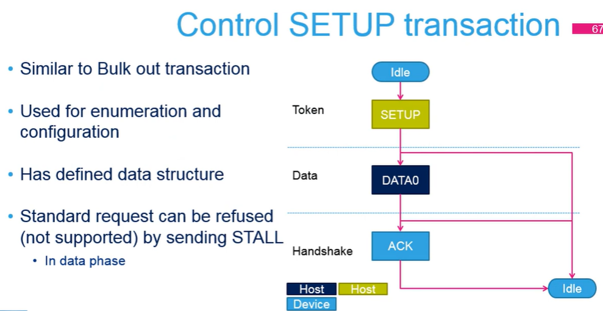

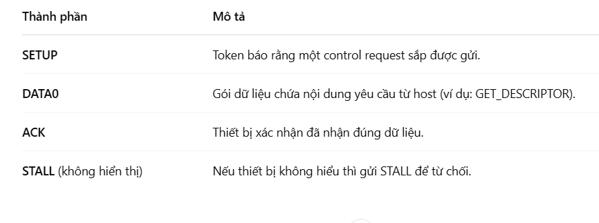

Tương tự Bulk luôn.

##### 3.6 SPLIT và PING Transaction:

Tối ưu hóa việc sử dụng bus tốc độ cao (High-Speed).
 
 1. Split transaction:

Dùng để tối ưu giao tiếp với USB Hub (Split Transactions), trong khi thiết bị tốc độ thấp (Low-Speed) hoặc tốc độ đầy đủ (Full-Speed) được kết nối với Hub.

Hub giao tiếp ở tốc độ thấp hơn (Low-Speed/Full-Speed) với thiết bị.

2. PING Transaction:

PING là một giao dịch đặc biệt trong USB 2.0 trở lên, được sử dụng trước khi gửi dữ liệu Bulk OUT lớn.

Máy chủ gửi gói PING để hỏi thiết bị: "Bạn có sẵn sàng nhận dữ liệu không?"

Nếu thiết bị trả về ACK (Sẵn sàng), máy chủ sẽ gửi dữ liệu. Nếu trả về NAK (Chưa sẵn sàng), máy chủ sẽ thử lại sau, tránh làm tắc bus.

#### 4. Control read/write sequence(Quá trình đọc/ghi điều khiển trong USB ở cấp độ Transfer):

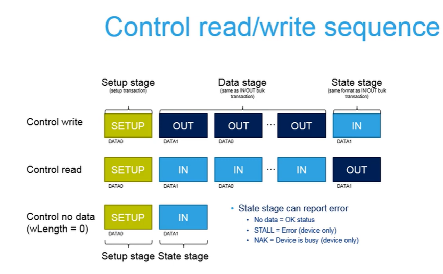


Nội dung mô tả Định dạng tiêu đề yêu cầu (Request Header Format) trong USB và quá trình truyền:

bmRequestType (1 byte): Xác định hướng và loại yêu cầu:
Hướng (Direction):
- 0: Host-to-device (Máy chủ đến thiết bị).
- 1: Device-to-host (Thiết bị đến máy chủ).

Loại (Type) [6:5]:
- 0: Standard (Chuẩn).
- 1: Class specific (Đặc trưng lớp).
- 2: Vendor specific (Đặc trưng nhà cung cấp).
- 3: Reserved (Dự trữ).

Đối tượng nhận (Recipient) [4:0]:
- 0: Device (Thiết bị).
- 1: Interface (Giao diện).
- 2: Endpoint (Điểm cuối).
- 3: Other (Khác).
- 4-31: Reserved (Dự trữ).

bRequest (1 byte): Mã yêu cầu cụ thể.


wValue (2 bytes): Giá trị tham số.

wIndex (2 bytes): Chỉ định số giao diện hoặc điểm cuối (*).

wLength (2 bytes): Độ dài dữ liệu trong giai đoạn dữ liệu.

**Ví dụ 1:**


**Ví dụ 2:**


Transfer (Truyền): Là một tập hợp các giao dịch (Transactions) để hoàn thành một yêu cầu USB đầy đủ (như Control, Bulk, Interrupt, Isochronous).


#### 5. USB descriptor:

Reference USB Composite : https://lazytrick.wordpress.com/2016/07/18/usb-cho-dev-chap-05-dac-ta-thiet-bi/

Mục đích:
Máy chủ (Host) sử dụng các mô tả (Descriptors) để lấy thông tin về thiết bị (Device).

Nếu thiết bị không có mô tả được yêu cầu, nó sẽ trả về STALL (tín hiệu cho biết không hỗ trợ hoặc không có dữ liệu).

Mỗi mô tả (Descriptor) có tiêu đề 2 byte:
- Byte 1: Kích thước của mô tả (bLength).
- Byte 2: Loại mô tả (bDescriptorType).

String Descriptors (Mô tả chuỗi):
Được tham chiếu bằng chỉ số (Index) từ các mô tả khác (ví dụ: Device Descriptor, Configuration Descriptor).
Có thể được dịch sang các ngôn ngữ khác nhau (hỗ trợ đa ngôn ngữ).


 
 **5.1. Quá trình liệt kê Enumeration:**


 **5.2 Các loại descriptor:**

 https://www.beyondlogic.org/usbnutshell/usb5.shtml#DeviceDescriptors

 - Device Descriptor: mô tả toàn bộ thiết bị, tên, nhà sản xuất, số sê-ri. Dữ liệu chuỗi được mô tả bằng các chuỗi mô tả riêng biệt (String Descriptor)

 - Configuration Descriptor: một thiết bị có thể có 1 hoặc nhiều caaud hình. Mỗi thiết bị có :tốc độ giao tiếp riêng, inerface và cài đặt power riêng.Các thiết lập cấu hình không giới hạn ở sự khác biệt về công suất. Mỗi cấu hình có thể được cấp nguồn theo cùng một cách và sử dụng cùng một dòng điện, nhưng có các kết hợp giao diện hoặc Endpoint khác nhau. Tuy nhiên, cần lưu ý rằng việc thay đổi cấu hình yêu cầu mọi hoạt động trên mỗi Endpoint phải dừng lại. Mặc dù USB cung cấp tính linh hoạt này, nhưng rất ít thiết bị có nhiều hơn 1 cấu hình.

 - Interface descriptor: có thể được xem như một tiêu đề hoặc nhóm các điểm cuối thành một nhóm chức năng thực hiện một tính năng duy nhất của thiết bị. Ví dụ, bạn có thể có một thiết bị fax/máy quét/máy in đa chức năng. Bộ mô tả giao diện một có thể mô tả các điểm cuối của chức năng fax, Bộ mô tả giao diện hai là chức năng máy quét và Bộ mô tả giao diện ba là chức năng máy in. Không giống như bộ mô tả cấu hình, không có giới hạn nào về việc chỉ bật một giao diện tại một thời điểm. Một thiết bị có thể bật 1 hoặc nhiều bộ mô tả giao diện cùng một lúc.
 
 Interface descriptor giao tiếp với thiết bị. Có thẻ có vài interface. trong USB composite, ta sẽ triển khai nhiều interface để chúng thực hiện.

 - Descriptor endpoint (Endpoint descriptor): mô tả kênh truyền thông trong một giao diện cụ thể, thiết lập kích thước gói tin, mô tả các tham số của ngắt. Sử dụng các điểm cuối chúng ta sẽ nhận và nhận dữ liệu.

 -  IAD (Interface Association Descriptor) là gì?
Là một descriptor phụ được thêm vào trước một nhóm interface để nói rằng “mấy cái interface này thuộc về một chức năng duy nhất”.
> Ví dụ: một thiết bị CDC (Virtual COM Port) có thể có 2 interface:
>
> Interface 0: CDC Control
>
>Interface 1: CDC Data
>→ Nếu không có IAD, host có thể nhầm tưởng hai cái này là 2 thiết bị khác nhau.

- Phân cấp các Descriptor trong code: https://www.beyondlogic.org/usbnutshell/usb5.shtml#DeviceDescriptors


- Giải thích hình ảnh màu cam ở trên:


- Cụ thể hợ về subclass: 

### IV. Kiến thức bổ sung:

Cổng COM

thành Virtual COM Port (COM ảo)


> Mục đích là để có thể giao tiếp với cổng COM bất chấp máy tính có cổng giao tiếp vật lí của COM hay không (vì đã có VCP hay Virtual COM Port làm nhiệm vụ chuyển đổn dữ liệu từ USB sang cổng COM rồi - Tránh việc đòi hỏi phải có cổng COM vật lí mới có thể giao tiếp trong khi máy tính của bản thân không có cổng COM vật lí). Và USB class CDC có thể hỗ trợ trở thành 1 VCP để giao tiếp nối tiếp. VCP không phải là 1 class chính thức mà là một ứng dụng cụ thể của class CDC.


  **Reference: https://lazytrick.wordpress.com/2016/01/25/usb-driver-va-usb-device-firmware-se-viet/**

- Khởi tạo các thành phần: speed, endpoint, setup, Descriptor, class


